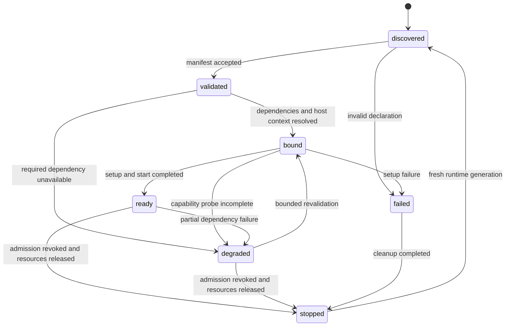
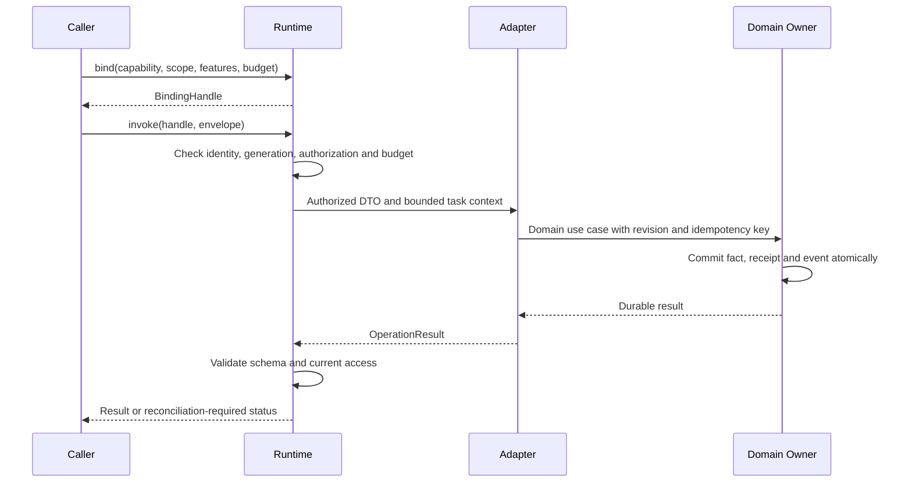

# 外部插件接入生命周期与适配器规范 v0

> 导航：[设计总纲](./FRAMEWORK_DESIGN.md) / [主题目录](./FRAMEWORK_DESIGN_INDEX.md)。定位：生命周期规范草案；依赖注入协议，维护注册、调用、撤权和释放语义。

> 状态：2026-09-08 设计草案。已补公共控制面的方法字段、责任和故障场景，待转为机器 Schema；不表示 SDK、派发器或热重载已实现。主线是新框架设计，旧入口用于核对可复用基础。

本稿细化 [Companion Injection Protocol](./COMPANION_INJECTION_PROTOCOL.md) 第 7 节，复用其控制面、六类能力和结果状态。记忆的业务字段以[记忆外部接口](./MEMORY_PROPOSAL_QUERY_CONTRACT_V0.md)为准，首个适配器见[记忆参考适配器设计](../../astrbot_plugin_remember_you/docs/MEMORY_ADAPTER_DESIGN_V0.md)。其他领域可以沿用本生命周期，不复制一套注册、权限或任务管理系统。

## 1. 接入责任

| 参与方 | 责任 | 不持有的内容 |
| --- | --- | --- |
| Host / Packaging Shell | 加载组件、绑定实际插件/服务身份、通知初始化/终止；AstrBot 是首个实现 | 不解释记忆或主动业务 |
| 陪伴控制面 | 注册、能力协商、作用域和授权、绑定 revision、准入、诊断 | 领域原始数据库、媒体或凭证 |
| TaskSupervisor | 有期限的调用和资源任务、取消传播、卸载收束 | 模型语义与事实归属决策 |
| 扩展适配器 | 将标准请求转换为领域用例，将结果映射回协议 | 其他插件对象、主陪伴普通回复的写入权 |
| Feature Service | 领域事务、证据、索引、连接与持久化回执 | 通过注册自动取得的额外授权 |
| 调用方 | 声明所需能力、用途和预算，消费真实回执 | 指定任意 provider 或 scope 来扩大权限 |

后续实现可复用已有 `companion/injection.py` 和公开 facade 的兼容基础；当前只做设计。适配器可以是服务内的薄函数集合；只有独立生命周期或资源所有权需要时才增加模块。Python handler 在宿主本地挂接，不能塞进跨插件 DTO 或 manifest 的 JSON。独立/嵌入 shell 注入同样的身份、时钟、存储和任务端口，领域控制逻辑不判断宿主名称。

## 2. 状态与就绪条件

沿用 ExtensionStatus 的 discovered、validated、bound、ready、degraded、stopped、failed。安装和 enabled 是配置状态，授权按调用方/作用域判断，二者不由 ready 推断。

取消安装或初始化时，discovered/validated/bound 也可进入 stopped。卸载过程用 `phase=quiescing|draining|closing` 描述，不新增一套生命周期主枚举；各能力准入在进入 quiescing 时已关闭。若不能证明旧任务已结束或写入已受隔离，则保留 failed、admission=false 和残留资源诊断，不提前标记 stopped。

ready 必须同时满足：manifest/schema 通过校验、必需依赖已协商、handler 已挂接、宿主身份有效、setup/start 完成、领域明确报告可服务。提供方的就绪报告经控制面验证，不能自行改变 ACL。扩展 degraded 时，未受影响的能力可以保持 ready；失效能力返回 unavailable。控制面展示逐能力原因、版本、generation、有效预算和最近一次检查时间。

## 3. 注册与探测

1. 宿主依据实际加载插件身份创建注册上下文；manifest.provider 必须与该身份关联，不能仅相信 JSON 中的名字。
2. 在本地校验 ExtensionManifest、能力描述、已登记 schema 与领域描述符；校验描述符的 namespace、版本和大小，不加载任意 URL schema 或运行扩展代码。
3. 对一个 manifest 的元数据和 handler 表做原子发布：全部结构合法才 visible；能力有可选依赖故障时保留声明并逐项 unavailable，而不是丢失整份清单。
4. 同一身份、generation、manifest 摘要重复注册返回已有句柄；内容变化要求显式 revision 更新或新代替换。同名不同提供方按各自身份登记，不覆盖现有绑定。
5. probe 默认只核对本地 schema、依赖、handler、存储就绪和任务句柄，不调用 LLM、不写测试事实、不发送消息。连接探测若必需，声明权限和有限预算，结果注明时间与覆盖面。

setup 只准备本代 handler 和受监督资源；start 才启用领域允许的任务。初始化失败只释放本次取得的资源，不关闭其他调用方仍在使用的共享服务。阻塞 I/O 不在全局注册锁内执行；不同提供方可独立准备，通过短原子操作发布最终状态。

## 4. 控制面操作语义

下表是 SDK 待实现的语义操作名，不是已可调用的方法清单。具体 Python 命名复用现有 facade；调用方不直接访问注册表内部容器。

| 操作 | 输入 | 返回与约束 |
| --- | --- | --- |
| register | 宿主上下文、manifest、领域描述符、宿主本地 handler 映射 | RegistrationHandle；原子发布元数据，未完成 start 不可调用 |
| discover | 能力需求、scope_selector、用途和分页预算 | 当前获授权的能力摘要页；不执行 probe、加载 provider 或签发绑定 |
| probe | 注册句柄、有限 probe budget | 能力就绪快照和检查时间；不把一次 probe 当持续健康证明 |
| bind | 能力/版本需求、required_features、作用域选择器、用途与预算 | BindingHandle 或标准错误；先授权，再在显式配置范围内选择兼容提供方 |
| invoke | BindingHandle、标准 RequestEnvelope、operation/task/attempt 关联 | 领域 OperationResult；分配一个共享 deadline 和预算，不暴露宿主对象；重试沿用逻辑 operation |
| subscribe / acknowledge | 事件能力、绑定、游标、消费预算 / subscription_id、event_id | 受限订阅及消费确认；订阅独立授权，不随 read/write 自动授予 |
| release | 调用方自己的绑定或订阅句柄 | 停止该句柄的后续使用；不卸载共享提供方 |
| cancel | task / operation / 本次调用的定位、当前授权、适用 revision 与原因 | 取消意图回执及目标状态引用；受理取消不证明外部效果已撤销 |
| operation.lookup | 原 owner、操作 ID 或原稳定幂等键、当前作用域与用途 | 原操作/回执的授权引用；查询成功可以对应业务 uncertain |
| session.resume | 新绑定、原 session/checkpoint、预期 revision 与旧控制代 | 持久恢复回执及 SessionRecord 引用；重新授权并原子接管，未就绪仍为 reconnecting |
| revoke | 管理者或宿主上下文、授权/绑定/提供方目标、原因 | 先关闭受影响准入，再停止任务和事件投递；不能抹掉已提交事实 |
| unregister | 宿主 RegistrationHandle | 资源收束后删除该代注册；保留必要诊断和领域账本 |

RegistrationHandle、BindingHandle 和 SubscriptionHandle 为运行时签发的不透明引用。内部至少关联调用方身份、能力版本、描述符 revision、provider_generation、作用域指纹、授权 revision、有效预算、到期时间和释放状态。TaskHandle、operation_id、attempt_id 和 checkpoint_ref 也由相应 owner 管理；普通业务 DTO 不直接构造这些身份保证。句柄是定位/准入引用，不是事实、权限或平台凭据。

现有 register_extension/set_extension_status/unregister_extension 属兼容控制入口。本稿的句柄、调用边界和回执通过新 SDK 版本发布；不能把原来的 `ok=true` 注册回执解释成具有新准入和卸载保证。

### 4.1 公共控制输入与签发责任

下面七种操作使用[注入协议 §4.3](./COMPANION_INJECTION_PROTOCOL.md#43-控制请求与结果边界)的控制封套。字段设计已转入独立的 [control profile 0.1.0](./contracts/control/v1/README.md)，但仍未实现运行时；原记忆请求及公共执行记录保持各自封闭格式。probe、revoke、unregister 等沿用本稿的责任语义，其 wire 后续补齐，不因此宣称整个 SDK 已定型。

`CapabilityRequirement` 为 `{capability_id, major, min_minor, required_features}`，复用描述符依赖项的版本语义，调用需求不含 optional。`ScopeSelector` 为 `{ecosystem_id, installation_id, kind, target_ref}`，kind 使用描述符 scopes 的枚举，target_ref 是可信身份目录可解析的规范引用；选择器只是定位请求，不是已授权 RuntimeScope。裸平台账号/用户 ID 先经 IdentityAdapter 在平台命名空间内解析；注册身份直接来自宿主安装上下文。

| 身份或记录 | 签发/维护者 | 查询与迁移边界 |
| --- | --- | --- |
| caller_ref、scope_ref、owner 路由 | 身份解析器、控制面及对应领域 owner | caller/owner 的稳定逻辑身份可保留；当前权限和平台映射重新解析 |
| registration_ref、binding_ref、provider_generation、descriptor_revision | 当前 Runtime 控制面 | 只在本 runtime 租约内有效；不得从备份恢复成可用句柄 |
| task_id、attempt_id、task_revision、supervisor_generation | TaskSupervisor / 任务 owner | 持久 task 可续接；新尝试与控制代重签，原 effect 先对账 |
| operation_id、幂等键映射、提交回执 | 被调用能力的领域 owner | 稳定 caller + owner + 能力主版本下查询；provider 替换不重建事实归属 |
| session_id、session_revision、controller_generation、checkpoint | Session owner | session/checkpoint 可按迁移策略保留，控制代和 capability grants 必须重新核验 |
| DeliveryReceipt、receipt_revision、平台映射 | delivery owner 及其平台 adapter | 原平台效果只向原回执来源对账；迁移到新平台不能把旧发送重新投递 |

owner_ref、task_id、operation_id、session_id 和 receipt_ref 都是定位值；知道它们不授予读取或修改权。运行授权由可信 caller 和当前目标绑定解析；签发者暂时不可用时可返回 unavailable，不能从缓存猜测成功。控制面只持有这些记录的受限索引/引用，不将全部领域账本复制成中央数据库。

### 4.2 register / discover / bind / release

| 方法 | params 字段 | output 与具体语义 |
| --- | --- | --- |
| register | manifest、descriptors、expected_registration_revision | RegistrationHandle 及首份能力状态页引用；首次 expected_registration_revision=null，更新需匹配当前 revision；handler 表通过可信本地端口挂接 |
| discover | requirement、scope_selector、purpose、cursor、page_limit、max_page_bytes | entries、catalog_revision、observed_at、next_cursor、expires_at；第一页 cursor=null，结束 next_cursor=null |
| bind | requirement、scope_selector、purpose、candidate_ref | BindingHandle；candidate_ref=null 表示按当前显式配置选择，否则约束到发现页中的特定兼容候选，候选失效返回 binding_stale |
| release | handle_kind、handle_ref | handle_ref、released_at、disposition；handle_kind 为 binding/subscription，disposition 为 released/already_released |

注册一次校验元数据大小、schema 指纹和 handler 完整性，再原子发布。一个 generation 内相同 manifest/描述符摘要的重复注册返回原句柄；变更采用 expected_registration_revision 做 CAS，重新生成受影响 descriptor_revision，关闭旧准入。新代必须由宿主重新鉴别并签发，提供方不能要求复用某个 generation。注册更新即使返回成功，也要经过 setup/start/readiness 检查才可调用。

discover 先按授权、owner 配置和用途筛选，再分页；权限拒绝不通过总数、错误细节或 candidate_ref 暴露隐藏 provider。每页同时受条目数和 UTF-8 字节上限限制，单项超限返回明确错误。摘要只包含候选引用、精确版本、状态、有效 features 与描述符引用，不复制 Schema、handler、媒体或所有 owner 数据。cursor 绑定 caller、selector 指纹、查询摘要、授权 revision、catalog_revision 和期限；授权或相关目录版本变化使下一页返回 cursor_stale，由调用方在原预算内重查，不混合两版目录，也不为每个 cursor 常驻复制整个目录。

bind 对稳定 owner、当前权限、版本/schema/feature、依赖可用性和资源额度做一次协商，原子检查所用 revision 后签发句柄。candidate_ref 不能越过管理员配置或扩大 caller 权限；没有候选时 unavailable，候选同级冲突时 binding_conflict。在公布的控制重试窗内，相同控制幂等键的重试只返回原绑定或其失效结果，不因响应丢失创建第二份资源；已释放、过期或撤权的原绑定不能借重试复活。窗口外停止自动重放；caller 需要重新绑定时创建新的逻辑控制请求并重新授权，任何可能残留的旧句柄仍计入总额度并按租约回收。bind 不启动领域任务，也不为每个聊天克隆 provider 或 schema 注册表。

release 原子关闭该句柄准入，解绑它持有的短期引用；租约到期也执行同样的回收。已受理的任务、操作和 session 保留各自 owner 与恢复记录；如需停止业务，显式走 cancel 或领域 session.end。释放订阅会停止后续投递，但不抹掉已持久化 ACK/checkpoint。资源关闭由最后一个实际资源 owner 决定，不能按最后一个 BindingHandle 简单推断共享服务无人使用。release 回执在有界窗口内幂等，窗口外旧句柄保持不可用，可返回 handle_expired；引用不复用，不靠永久墓碑占满内存。

### 4.3 cancel：意图、停止证明和业务效果

params 为 `{scope_selector, target, expected_revision, reason_code}`。target 使用封闭的判别结构：task 为 `{kind, owner_ref, task_id}`；operation 为 `{kind, owner_ref, capability_id, major, locator}`；invocation 为 `{kind, request_id}`。invocation 只定位本 caller 在当前 runtime 已登记的在途调用，适用于尚无 operation_id 的短调用；未知 request_id 不创建“将来自动取消”的永久记录。operation 的 locator 与 §4.4 相同，可使用原幂等键定位。

expected_revision 对 task 必填当前 task_revision；对支持 revision 的 owner 操作使用已读版本，否则为 null；invocation 为 null。revision 冲突返回 revision_conflict 及获授权的最新引用，不覆盖新任务状态；安全撤权走独立 revoke，不能因为普通取消命令的旧 revision 而延迟撤权。cancel 本身有控制幂等键，不复用原业务幂等键作为一份新的业务请求。

output 为 `{cancellation_ref, target_ref, disposition, task_ref, operation_ref}`，不适用引用为 null；disposition 为 request_recorded / already_terminal / proven_stopped / reconciliation_required。收到 request_recorded 表示取消意图已由目标 owner 记录；未提交任务停止新调度并进入 cancelling，最终状态由实际 barrier 决定。短 invocation 允许仅在其有限生命周期内记录取消；跨重启需要持久证据的控制回执必须交给 task/operation owner。

| 已观察到的 barrier | 允许的效果结论 | 控制面后续动作 |
| --- | --- | --- |
| 未准入，或 owner 证明提交前已停止 | proven_stopped；原操作可 cancelled/not_applied | 回收本任务资源，保留必要停止证据 |
| 已持久完成/部分完成 | already_terminal；保留实际 applied/partial | 不反向改成 cancelled；用户需要补偿时另建明确授权的领域动作 |
| 已派发，提交或远端停止情况未知 | reconciliation_required；原操作 uncertain | 对原 owner/平台查账，禁止因 cancel 成功重新发送 |

cooperative 只表示支持传播停止请求，不能宣称一定停止；before_commit 只承诺本地提交前的取消边界。none 时控制面仍可阻止尚未派发的 task，但不向已执行能力伪造取消成功。父任务取消以原预算和分页子任务索引传播，已完成和未知子步骤保留真实状态，不创建全量内存任务树。调用方已释放旧绑定时，cancel 根据持久目标与当前权限重新解析控制路径，不需要复活旧 provider_generation。

### 4.4 operation.lookup：原 owner 对账

params 为 `{scope_selector, owner_ref, capability_id, major, locator, purpose}`。locator 恰有一种形式：`{kind: by_id, operation_id}` 或 `{kind: by_key, idempotency_key, part_id}`，part_id 不适用时为 null。by_key 的 caller 命名空间取自可信身份，不允许任意填写他人的 caller_ref；代理查询必须有独立授权。owner 路由由控制面验证，不能把字段拼成数据库路径或远程 URL。

output 为 `{lookup_state, operation_ref, result_ref, receipt_ref, observed_at, retention_expires_at, retry_proof_ref}`，lookup_state 为 found / not_found / expired；引用在不可用或不适用时为 null，retention_expires_at 未知时为 null。found 必须至少能定位 operation_ref；结果正文通过对应领域的授权读取入口有界解析，保持其原 schema。提供方离线且没有可访问的权威账本时是控制 unavailable，不能返回 not_found。

not_found、expired 或租约消失不证明原动作未提交，retry_proof_ref 默认 null。只有 owner 能验证的未提交证据或仍有效的远端幂等保障才可给出 retry 依据；查账不得触发 send、生成、补扣费用或记忆写入。原业务 deadline 到期后可以用预留的有限恢复额度查账，不能重置原执行预算。查到已提交事实但当前 caller 无正文权限时，仅返回允许的最小状态/引用或 permission_denied，不回放旧成功正文。

Runtime 重启后，新实例可以在当前授权下访问同一稳定 owner 的原账本；新 provider 必须明确接管原 owner 与数据 lineage，不能把同名能力的新数据库当旧账本。平台迁移后查询仍指向原平台回执来源；查询不可用就保留 unknown，不向新平台补发。大量未决操作通过有界页和共享恢复队列对账，不为每个 operation 创建永久轮询器。

### 4.5 session.resume：原会话受控接管

params 为 `{binding_ref, owner_ref, session_id, expected_session_revision, expected_controller_generation, checkpoint_ref, expected_context_revision}`；绑定必须属于当前 caller 且协商 checkpoint 恢复，预期 revision 为当前已读非负整数，旧控制代和 checkpoint 都只是前置条件。调用方不能指定新的 controller_generation、participants、capability_grants 或任意 phase=active。Session owner 解析当前参与者、人格和 grant，有新增权限需要时遵守现有确认策略，不把 resume 当自动续权。

1. 在有限预算内解析 checkpoint 元数据、当前参与者/人格/权限和依赖能力；普通 resume 只接受 paused/reconnecting 且当前未超过 expires_at 的 session，checkpoint 属于原 owner/session 且 context_revision 匹配。requested/invited/joined 继续原加入流程；ending 及终态不能恢复。active 会话不能凭普通 resume 抢占，先由 owner 证明断线并转 reconnecting，或通过独立的显式接管策略。
2. owner 在同一原子边界核对 session_revision、旧 controller_generation、期限和当前授权 fence，登记恢复操作及控制幂等键、保留同一 session_id，签发新 controller_generation，推进 session_revision 并置为 reconnecting。旧流量和旧 callback 从此失效。在控制重试窗内，相同键先查询原恢复回执，不能因为本次操作已经推进 revision 而误报冲突或签发第二个控制代；不同键竞争只允许一个成功。
3. 连接准备由受监督的恢复任务驱动，共享原 session 剩余额度；进度/上下文按引用有界读取。可以先返回 pending 与持久 resume_receipt_ref，SessionRecord 保持 reconnecting；全部必需能力就绪后才由 owner 更新 active。准备失败释放本次资源，保持可解释的 reconnecting/failed，不复活旧控制者。

output 为 `{resume_receipt_ref, session_ref, controller_generation}`，必须可定位恢复回执；phase 等事实由 session_ref 对应的最新 SessionRecord 查询。控制回复丢失后在约定窗口内使用原键查询同一恢复操作，窗口外先读 session 与 owner 恢复账本；真正一次新的恢复必须读取最新 revision 并创建新的控制键。旧 checkpoint、旧 grant 或结束后的迟到回调不能重新激活会话。

新平台不支持原房间/媒体语义时返回 unsupported_feature 或明确的不可恢复状态；连续历史摘要可以支持另行授权的新 session，不能伪装成原实时房间恢复成功。会话结束仍由领域 session.end 负责，释放 binding 或取消一个恢复 task 不等价于结束整个 session。

## 5. 协商、绑定和失效

绑定优先解析授权和稳定 owner，再按该 owner 的显式提供方配置筛选能力主版本、schema 修订、必需 features 与 limits。存在同优先级冲突时返回 rejected/binding_conflict，缺依赖为 unavailable/capability_unavailable，缺必需语义为 rejected/unsupported_feature。权限拒绝不泄漏隐藏提供方或对象存在性。

| 标识 | 变化条件 | 失效范围 |
| --- | --- | --- |
| `provider_generation` | 实例加载/替换，宿主重启；由 Runtime 生成不可复用代际标识 | 所有持有旧实例的绑定、任务与 callback |
| `descriptor_revision` | schema、features、limits 或 handler 声明变化 | 受影响能力重新协商，不能沿用旧 schema 派发 |
| `binding_revision` | 提供方选择、授权或目标人格绑定变化 | 受影响调用方的未提交请求重新校验 |
| `owner_ref` | 稳定事实归属，仅经受控归属迁移改变 | 不随 session、generation 或普通设置变化重建 |
| `memory_revision` / 领域 revision | 事实提交、纠正、撤回或过期 | 查询缓存、证据投影和依赖该事实的候选 |

SDK 可缓存绑定，缓存以这些标识和期限约束；invoke 仍做轻量准入检查，不每次完整 probe、不创建每能力永久轮询器。控制面变化事件和有界退避驱动恢复，idle 能力不持续消耗模型预算。

只读备用提供方必须读取同一权威数据或可验证的新鲜投影，原总预算内才能回退。写入提供方切换必须先完成单一写入所有权交接，并确认未决操作归属；不能按健康分数自动把 uncertain 写入发送给另一个数据库。

### 5.1 控制面资源与租约

控制面本身也必须有界。安装配置在注册前提供元数据总字节、描述符/依赖边数量、解析深度、schema 缓存、caller 句柄数、总句柄字节、控制在途请求及持久控制回执的有限上限；缺失有效配置时不开放准入。限额用于资源和权限边界，领域语义理解仍由证据和提示词处理。实际数值随设备资源配置与测量调整，不由插件自行提高。

| 资源 | 计量与回收 | 避免的放大 |
| --- | --- | --- |
| manifest / schema / handler 元数据 | 读取/解码前做字节与深度限制，按指纹共享不可变 Schema；handler 引用只归当前 provider 代 | 不在每个 binding、session 或聊天缓存一套 schema/插件对象 |
| 注册和绑定租约 | 有限 expires_at，provider 心跳可批量续注册租约；活跃绑定按需续期且重验授权，闲置到期释放 | 不为每个句柄创建定时器、后台协程或 LLM probe |
| 发现页、cursor 和缓存 | 页数/字节双限；cursor 有期限，缓存键含权限和目录 revision，采用有界共享缓存 | 不保存每个用户的完整目录快照，不全量发现后再截断 |
| 控制幂等记录和 tombstone | 回执保留窗覆盖明确的控制重试窗；状态命令按 owner 持久化并分页回收，内存仅保留热索引 | 不用无限字典保存所有请求；过期不会使旧操作自动获准重做 |
| 取消、恢复、对账 | 安装级有界工作队列，合并同一目标的重复等待，共享父/owner 剩余额度和清理预留额度 | 不按子任务树全量展开，不因平台断线持续复制上下文或缓存媒体帧 |

注册租约失效先关闭该代准入，并按 §8 撤销写资格和清理；普通续租不改变 generation，但已经失效的代不能通过迟到心跳复活。跨进程超时使用 runtime 权威时钟/本地单调 deadline，wire 期限用于关联，不相信 caller 修改时间延长授权。运行效果未知时可回收内存工作集，但要保留原 owner 的持久最小对账记录；存储不足则停止新增相关写入并报告，不静默删掉未决账本。

## 6. 调用、提交与结果

适配器只能使用本次任务授予的证据解析、取消、预算和诊断服务。TaskContext 是宿主本地引用，不序列化或让旧代后台任务长期持有。派生抽取、索引和网络任务共享父请求的总预算、deadline 和取消原因；子任务必须登记 parent_task_id 和有界的 caused_by 引用，不得形成无限后台链。

校验分为准入、提交、输出三个检查点：准入阻止旧句柄启动；提交由 owner 原子校验授权/代际 fence 与 expected_revision；输出重验当前调用方权限并校验结果 schema。纯粹在 Python 调用前检查 generation 不足以阻止已经进入线程的写操作，需要 store 的提交边界参与。

取消在可证明未提交时返回 cancelled；超时在可证明未执行时返回 timeout。无法证明时为 uncertain，由原能力的 operation 查询或平台回执对账，不能只依赖 memory.operation.get 处理其他领域。若提交后授权撤销，控制面返回权限错误并裁剪正文，已提交账本由获授权者查询；不能返回带旧权限的完整结果。未知结果状态和 schema 错误必须拒绝消费，不能自动重试写入。

只读查询不会自动写反馈或更新“已使用记忆”；此类领域反馈需要独立明确的证据和用例。Memory 的成功也不触发自动消息投递。

## 7. 订阅与事件回放

订阅绑定调用方、owner 范围、事件能力、generation、授权 revision、最大积压量和有限保留窗口。来源事件先在 owner 的本地 outbox 提交；控制面只路由引用和获授权的必要摘要。恢复时重新授权，不能通过旧 cursor 重读已撤回原文。

消费者在投影与消费游标持久化后 acknowledge；重复事件按 event_id 去重，乱序按实体 revision 收敛。背压先停止或合并可合并投影事件；不能丢弃撤回语义。积压超过保留窗口时明确要求有界重同步并使旧投影暂不可用，不能继续宣称缓存新鲜。事件重放默认只更新事实投影，不重放发送、设备或付费动作。

revoke 立即停止受影响订阅准入和未交付队列，通知消费者失效相关缓存。原始数据和墓碑仍由各领域 owner 按治理策略处理；移除插件声明不等于删除所有事实。

## 8. 热重载与卸载

1. 控制面原子关闭旧代 admission，撤销绑定和新的事件投递；记录 phase=quiescing、原因与旧 generation。
2. Supervisor 停止创建子任务，对未提交任务传播取消；向 owner 的提交 fence 撤销旧代写入资格。
3. 在 shutdown budget 内等待任务和线程操作收束。逐项区分 not_committed、committed、uncertain，禁止将所有任务统一记作 cancelled。
4. 停止订阅/handler，按资源所有权释放连接、任务和缓存，再调用 stop(reason)。句柄释放与宿主 stop 可重复调用而不重复关闭资源。
5. 清理旧代注册并记录 stopped；新代重新 register/setup/start/probe，使用新的 generation。写入恢复前先读取旧未决账本，重新授权与校验。

同一共享服务上的适配器解绑只释放适配器资源。只有 AstrBot 卸载实际 Memory 插件时才关闭其整个数据库和领域维护任务；单个聊天会话结束或陪伴核心重载不能调用共享 Memory service.aclose()。

线程任务不响应取消且可能继续写入时，不能仅靠超时就开放同一 owner 的新 Writer。若数据库能持久化 fence 旧代，可以让新代在对账后接管；无法保证则保持相关能力 unavailable，报告残留句柄并等待实际终止。其他领域能力继续运行。

## 9. 当前实现对照与第一批交付

截至本轮静态检查，[companion/injection.py](../companion/injection.py) 的协议常量为 0.1，已有 DTO、CapabilityRegistry 和 ExtensionRegistry。当前 capability 注册键是 `(id, version)`，不同 provider 的同键会冲突；resolve 按版本筛选，不具有上述按调用方授权、owner 与 generation 的完整绑定语义。[main.py](../main.py) 已暴露元数据注册/状态/注销 facade。

上述代码是可复用基础。后续可在现有控制面加入提供方维度、句柄与原子准入检查，保留旧 facade 的明确兼容行为；无需先另建一个 Kernel 发行包。旧 ExtensionStatus 没有的字段通过新描述符/版本化状态投影传递，不塞进旧枚举。

设计交付顺序：生命周期场景评审 -> 精确 schema 与兼容夹具 -> 薄 SDK/facade 的隔离实现 -> 记忆参考适配器 -> 真实运行验收。先对照[第三方一致性验收规范](./MEMORY_COUNTEREXAMPLE_EVAL_V0.md)，包括以下额外生命周期场景：

| case_id | 场景 | 必须观察到的结果 |
| --- | --- | --- |
| LC-01 | 重复注册、冲突声明、handler 挂接中断 | 原子注册；重复幂等，冲突不留下半份可调用清单 |
| LC-02 | 必需/可选依赖缺失，probe 超时 | 逐能力降级，无隐式写入、模型调用或永久重试循环 |
| LC-03 | setup/start 失败后重试 | 本次资源被释放，其他共享连接保持可用，新代不复用旧句柄 |
| LC-04 | 绑定后改 descriptor、授权或人格 | 旧绑定在准入/提交/输出分别受检，影响范围局部化 |
| LC-05 | 写入线程不响应取消并晚提交 | 不虚报 cancelled；fence 或阻止接管，账本结果可对账 |
| LC-06 | 适配器释放、会话结束、宿主整个插件卸载 | 区分资源 owner；共享 Memory 只在宿主卸载时整体关闭 |
| LC-07 | 订阅积压、撤权、过期游标、重复/乱序回放 | 暂停/重同步明确；撤回不丢失，回放无外部动作 |
| LC-08 | Runtime 重启和多提供方恢复 | generation 不复用，只有选定 owner 接受写入，未知操作先对账 |
| LC-09 | task checkpoint 前后重启，原任务含未确定外部动作；另推进同一周期计划的下一次 occurrence | 原 occurrence 使用原 task、幂等键及已知 operation 对账，下一次触发使用独立键；新尝试重验权限/额度，旧 attempt 不能覆盖 task_revision |
| LC-10 | 在准入前、提交前和外部提交后分别取消；另一组平台不支持远端 fence | 仅已证明未提交时 cancelled；提交后保留真实回执/uncertain，本地换代不能据此重复外部动作 |
| LC-11 | Session 断线、旧 revision 回调、人格绑定变化和结束后恢复 | 重验参与者与 capability grant；旧上下文/媒体不能恢复 active，ended 不被旧回调打开；只释放本会话资源 |
| LC-12 | 父任务突发创建子任务，达到总字节/并发/深度/队列额度；另测试长时间断流 | 准入前有界拒绝或延后，不能复制父预算；上下文按引用分页，媒体不入通用持久队列；观察释放后残留 |
| LC-13 | 创作完成、封面晚到、分享分 part 投递，平台部分确认或重复回调 | 章节/图片/发送操作分别记账；旧封面不覆盖新作品；已确认 part 不重做，发送未知不触发重新生成或再次付费 |
| LC-14 | 自报 provider/generation、描述符与 handler 不符、注册更新响应丢失 | 身份由宿主鉴别；原子发布及 CAS 更新；重试返回原回执，无半份清单或新代重复创建 |
| LC-15 | 多页发现期间撤权/目录变化、超大描述符及大量 cursor | 不泄漏隐藏能力；旧 cursor 明确失效；读取前限制字节/深度，页和缓存峰值有界 |
| LC-16 | bind 响应丢失后同键重试，再 release/过期后重试原 bind | 返回同一绑定或失效结果；不重复分配、不复活旧句柄，共享服务保持其实际 owner 生命周期 |
| LC-17 | cancel 被受理但发送已完成/仍未知；旧 task_revision 取消及无 operation_id 的短调用取消 | 控制成功与业务状态分开；已提交不回退，未知不重发；revision 冲突不覆盖新状态，未知 request_id 不创建永久取消记录 |
| LC-18 | 原业务响应丢失，按 key 查询；随后撤权、账本过期或 provider 下线 | key 使用原稳定命名空间；not_found/expired 不成为未提交证明，下线返回 unavailable；不泄漏旧正文 |
| LC-19 | 两个恢复者以同 revision 竞争，成功回复丢失后同键重试，旧 callback 晚到；另从 invited/ending/已过期但未标 expired 的记录恢复 | 只签发一个新控制代；窗口内原键返回原恢复记录，旧代不能恢复 active；不绕过加入、结束或有效期限，资源准备失败释放本次占用 |
| LC-20 | 热重载/迁移导入原 binding，替换为无原账本 provider，目标平台不支持原会话 | 旧句柄无效；稳定 owner/operation 可授权对账；不向新平台重发，不伪造房间恢复成功 |
| LC-21 | 句柄/租约/控制重试突发，释放和去重窗口过期后继续压测，未决账本达到存储预算 | 聚合内存/队列/缓存/回执均计量；过期停止自动重放，业务未知不随控制缓存删除；无每句柄常驻轮询，旧代不因迟到续租复活；账本不足停止新增相关写入 |
| LC-22 | descriptor 声明新次版本/可选依赖 feature，caller 只有旧封闭 Schema；平台只有本地去重 | 无精确 Schema 交集则拒绝；依赖失效不继续授予相关 feature，owner_ledger 不升级为远端安全重试证明 |

目前 LC-01--LC-22 均为 run_status=not_run。LC-09--LC-13 对照[公共执行边界](./COMPANION_CONTRACTS_AND_VERTICAL_SLICE.md#公共执行边界)，已有[execution 0.1.0 review 包](./contracts/execution/v1/README.md)、110 个格式案例和两条跨领域设计夹具；尚未执行 workflow.steps。LC-14--LC-22 现已有 [control profile 0.1.0](./contracts/control/v1/README.md)、机器 Schema 和 3 条设计夹具，但仍没有运行证据。

下一项将 CapabilityDescriptor、注册/发现/绑定及 cancel/lookup/resume 的字段设计转为独立 control profile 的 Schema 与兼容夹具，补齐 ExtensionManifest、状态页及剩余控制方法的精确格式；优先验证响应丢失重试、旧句柄、控制成功但业务未知三类反例。之后才进入薄 SDK 隔离实现。设计走查、JSON 解析和静态关联检查不能作为并发、提交 fence、资源释放或实际卸载成功的证据。
