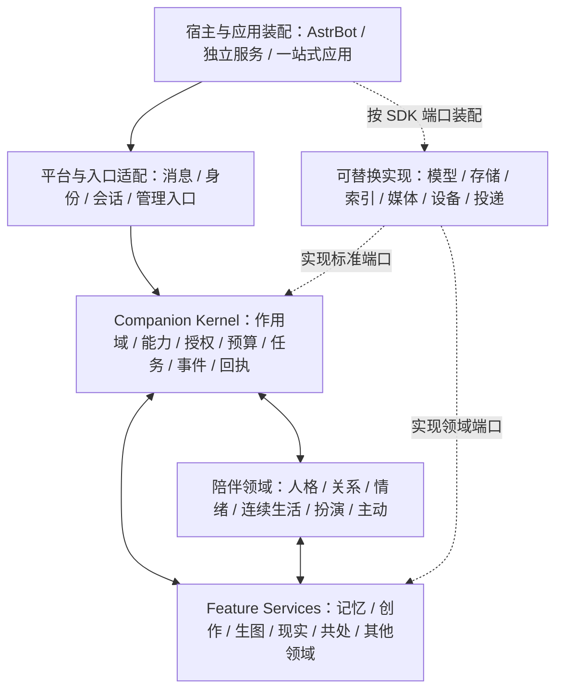

# 陪伴新框架设计总纲

> 更新：2026-09-08。本文是新框架的连续阅读入口，整合当前设计方向、职责、状态和推进顺序。详细字段和验收条件由[主题目录](./FRAMEWORK_DESIGN_INDEX.md)指定的稿件维护。当前仍处于设计与契约评审阶段，不能将文档完整度理解为实现完成度。

## 1. 我们正在设计什么

目标是一套由同一角色、关系和持续经历连接起来的陪伴应用框架。记忆、创作、生图、现实感知、共读观影、游戏和直播可以独立安装，也可以一起打包成应用；它们通过标准能力协作，不要求了解其他插件的内部代码。

工作的主次是：设计更高效、更好用的新框架为主，旧系统的优化、适配和迁移为辅。旧代码提供用户能力清单、行为样本和工程经验，不能决定新框架的永久模块边界。

五项共同目标：

1. **连续性**：同一角色跨会话仍有可恢复的生活、关系、记忆和未完成事项。
2. **语义自由**：AI 理解引用、否定、条件、多意图和表达方式，能够组合未预先枚举的行为。
3. **执行可靠**：作用域、授权、预算、版本、幂等、生命周期和真实回执由运行时保证。
4. **开放扩展**：原生与第三方使用相同契约，可注入来源、查询、类型、算法和执行能力。
5. **平台可移植**：AstrBot 是首个宿主适配器；迁移其他 Bot 平台或整合自有应用时复用领域服务、数据语义和 SDK。

效率以同等输入和预算下的实际表现评价，包括模型调用、答案证据覆盖、耗时、并发、内存和恢复成本。增加抽象数量、召回条数或主动频率都不代表优化完成。

## 2. 整体架构

下面表示职责与连接关系，不是领域代码的 import 顺序。核心用例依赖标准端口，具体宿主、平台、模型和存储实现由应用装配层注入。



| 层次 | 持有的责任 | 关键边界 |
| --- | --- | --- |
| Host / 应用装配 | 进程、启动停止、配置与密钥注入、组件选择 | 插件、独立服务和嵌入模式共用领域实现 |
| Platform / 入口适配 | 原生消息、账号、会话、媒体、投递和登录 | 原生 event/request 在此转换，不进入长期领域任务 |
| Kernel / SDK | 公共 DTO、能力协商、授权上下文、预算、任务监督、事件与回执协调 | Kernel 不拥有记忆算法、角色生活规则或扩展数据库；SDK 不启动运行时 |
| 陪伴领域服务 | 人格绑定、关系、情绪、生活连续性、回复与主动编排 | 各自拥有状态；通过同一回复和投递边界协作 |
| Feature Service | 自己的事实、算法、连接、任务、证据和治理 | 通过能力调用、事件和资源引用联动，不读取对方私有目录 |
| Provider / Storage / Device | 具体模型、数据库、索引、设备和网络实现 | 资源和事务由实际 owner 管理，大媒体不在 Kernel 中转 |

首期可在已有 `companion/injection.py` 和 facade 内演进，不为了包名再建一套注册表。`companion_kernel`、`companion_sdk` 是职责和目标包边界；是否独立发行，由契约和多宿主验证决定。

详见[架构基线](./ARCHITECTURE_RESET.md)与[平台可移植设计](./PLATFORM_PORTABILITY_AND_BUNDLING_V0.md)。

## 3. 领域地图与建设批次

| 领域 | 权威数据与能力 | 当前设计深度 / 建设位置 |
| --- | --- | --- |
| 陪伴核心 | 人格绑定与投影、关系、日历、连续生活、情绪、动机、主动机会 | 综合设计较详细；首条切片只取必要部分 |
| 记忆 | 事实原子、证据片段、查询、索引、ACL、保留、纠正与撤回 | 首条参考切片；已有字段、状态机、外部接入和适配器设计 |
| 世界模拟 | PersonaWorldModel、WorldEntity/Relation、ActivityProcess、EmbodimentState、WorldEvent 与可供性 | 已有学习中断/恢复的详细切片、三模式归属、资源与 WS-01--12 验收设计；日历边界和 WorldEntity/WorldEvent 已分别形成 `companion.calendar@1`、`companion.world@1` 契约 |
| 现实触及 | 设备与用户绑定、凭据、摄像头/音频/位置/健康观测、动作回执 | 第一优先级后续切片；需细化观测、授权、离线与动作契约 |
| 实时共处 | 房间、参与者、媒体进度、临时上下文、恢复与结束摘要 | 第一优先级后续切片；已有概念状态机，详细 Session 契约待补 |
| 创作 | 作品、章节、版本、作品内记忆、封面关联 | 第二优先级；已有联动契约，用于提前检验公共边界 |
| 生图 | 生成任务、参考图归属、后端能力、费用和媒体资源 | 第二优先级；生成、资源关联与发送分别验收 |
| 屏幕观察 | 采样、脱敏、短期画面和活动摘要 | 第二优先级；与现实/共处共享观察语义，不共享原始数据 |
| 游戏共处 | 玩家、席位、房间、引擎和对局结果 | 第二优先级；规则和引擎留在领域内 |
| 直播演出 | 直播 Session、弹幕、字幕、语音及 VTS/OBS 输出 | 第二优先级；实时输出和普通主动联系分开 |
| QQ 空间、问题治理 | 社交发布工作台 / 开发治理与审批 | 暂缓外围；保留生态位置和兼容能力 |

所有领域从设计期参与共同建模，防止公共接口只适配记忆。但“参与设计”不等于“所有插件先完成真实适配，记忆才能验证”。按切片选择生产方、消费方和故障场景；核心只读诊断可以先建设，Bug 插件的治理流程仍暂缓。

领域 owner 与源码目录可以分开：`remember_you` 是仓库目录，其插件 ID 为 `astrbot_plugin_memory_companion`。安装目录、平台昵称和宿主实例都不能直接作为授权身份。

## 4. 统一行为闭环

```text
消息、观察与执行证据
  -> AI 理解意图、归因、条件、情绪和动机
  -> 各 owner 校验并更新自己的状态
  -> AI 形成回复、记忆提议、主动候选或动作计划
  -> Runtime 校验能力、授权、预算与当前版本
  -> 领域事务或平台/设备执行
  -> 真实结果、用户反馈、纠正与过期
  -> 下一轮证据与状态
```

这个流程是逻辑分层，不要求每层调用一次模型。优先复用本轮语义结果，辅助分析按必要性、预算和可取消任务执行。

五类状态各有生命周期：场景状态短期保留；情绪可衰减；连续生活跨会话恢复；记忆按保留策略保存；外部观测按 TTL 失效。观察不自动成为事实，事实不自动成为主动候选，候选不自动发送，发送不自动证明用户认可。

被动与主动共用人格、上下文、表达、工具、投递和历史边界。实时音视频、字幕、嘴型、游戏帧仍在领域 Session 内处理，只有面向聊天窗口的新接触才进入主动接触预算。

详见[共同状态模型](./COMPANION_STATE_EVENT_FEEDBACK_DESIGN.md)和[首条纵向闭环](./COMPANION_CONTRACTS_AND_VERTICAL_SLICE.md)。

## 5. 公共契约与身份

公共契约按用途组织，不把所有对象塞进一个万能 envelope：

| 对象组 | 负责什么 | 详细依据 |
| --- | --- | --- |
| RuntimeScope、身份/人格绑定 | 本次调用属于谁、在哪里、使用哪个人格与授权 | [注入协议 §5](./COMPANION_INJECTION_PROTOCOL.md#51-scope)、[平台身份 §3](./PLATFORM_PORTABILITY_AND_BUNDLING_V0.md#3-宿主平台和数据身份) |
| CapabilityDescriptor、句柄与生命周期 | 能否注册、协商、调用、订阅、撤权和卸载 | [注入协议](./COMPANION_INJECTION_PROTOCOL.md)、[生命周期规范](./COMPANION_EXTENSION_LIFECYCLE_V0.md) |
| EvidenceRef、Observation、ContextContribution | 来源、时效、可见性和模型实际得到的证据 | [公共契约](./COMPANION_CONTRACTS_AND_VERTICAL_SLICE.md)、[记忆接口](./MEMORY_PROPOSAL_QUERY_CONTRACT_V0.md) |
| ActionRequest、OperationResult、DeliveryReceipt | 计划、执行结果和消息回执分别是什么 | [注入协议 §6.6](./COMPANION_INJECTION_PROTOCOL.md#66-actionrequest--actionresult) |
| TaskEnvelope、SessionRecord | 异步任务和持续会话如何取消、恢复和结束 | [公共契约](./COMPANION_CONTRACTS_AND_VERTICAL_SLICE.md)、[领域状态机](./DOMAIN_STATE_MACHINES_V0.md) |
| Fixture、验收报告 | 如何录制、回放和验证上述协议 | [回放与 SDK 边界](./PORTABLE_CANONICAL_FIXTURE_AND_SDK_V0.md)、[一致性验收](./MEMORY_COUNTEREXAMPLE_EVAL_V0.md) |

公共执行语义已归并到[公共契约](./COMPANION_CONTRACTS_AND_VERTICAL_SLICE.md#公共执行边界)：task/attempt、领域 operation 和会话 revision 分开，取消保留已发生效果，未知结果先对账，跨领域没有隐含原子事务。创作分享和共处恢复用于核对通用性；短同步查询不强制写任务账本，媒体帧不进入通用任务队列。已有[公共执行包 0.1.0 review](./contracts/execution/v1/README.md)：6 个公共 Schema、110 个格式案例与两条设计夹具，不直接扩充已有封闭的记忆契约。能力描述与控制方法的字段语义见[注入协议 §4](./COMPANION_INJECTION_PROTOCOL.md#41-capabilitydescriptor-字段设计)和[生命周期 §4](./COMPANION_EXTENSION_LIFECYCLE_V0.md#4-控制面操作语义)；独立的 [control profile 0.1.0](./contracts/control/v1/README.md) 已有 5 个 Schema、12 个格式案例和 3 条设计夹具。

身份需分为三层：

- **稳定逻辑身份**：`ecosystem_id`、逻辑 `installation_id`、`bot_id`、`persona_id`、canonical subject 和可见命名空间。
- **调用与运行身份**：`runtime_instance_id`、`provider_generation`、绑定/授权 revision、request/trace、临时 session。
- **外部映射**：宿主种类与实例、平台、账号、平台会话/参与者 ID，经授权的 IdentityBinding/ConversationBinding 关联到逻辑身份。

`host_kind` 表示宿主实现，例如 `astrbot`；`plugin_hosted` 等表示部署模式，两者不混用。纯内部调用无需虚构平台账号；对外投递必须解析真实目标。完整字段和空值语义由 schema 阶段落实，不拿示例中的省略字段作为绕过授权的方式。

长期数据使用 owner 的稳定键，RuntimeScope 只是调用上下文。记忆的兼容归属为逻辑 installation、bot、persona、subject 与 visibility namespace，并在 ecosystem 内解析为不透明 `owner_ref`；最终键 schema 与旧 NamespaceContext 的映射仍需验证。开新会话、重启或换平台不应隐式重建事实 owner。

跨平台身份不能凭昵称或相同数字合并；群和私聊不默认互通。已授权的连续性与禁止的共享必须同时验证。

体系预设 `session / user / global` 三种共享模式。session 按实际会话隔离；user 允许同一平台账号下的同一用户跨私聊和群聊共享获授权的用户状态；global 使用显式 installation/bot/persona 公共分区。模式不代替当前受众、权限或保留策略，换预设不自动迁移历史数据。精确 wire 见[共享契约包 0.1.0 review](./contracts/sharing/v1/README.md)：通过 `companion.sharing@1` 在已有 Memory extensions 中接入，新 ContextContribution/StateTransitionProposal 才使用顶层共享字段；不修改已有 Memory v1 指纹。已有 5 个 Schema、59 个格式案例、12 个示例和 SHR-01--12 待运行场景。

## 6. 记忆：首条参考切片

记忆分成提议、权威事实、查询证据和治理意图四部分；世界模拟是其重要的消费方和受控提议来源，但不复制记忆库。标准能力为：

| 能力 | 结果 |
| --- | --- |
| `memory.proposal.submit` | 接受 add/correct/retract/no_op，返回提议/提交回执及操作引用 |
| `memory.query` | 在授权候选空间检索并返回完整 AnswerEvidence |
| `memory.operation.get` | 查询已提交、未提交或未知操作，支持丢回执恢复 |
| `memory.changed` | owner 发布带 revision 的变更，传播纠正、撤回和到期 |

提议的 `pending/collected/accepted` 不属于长期事实状态。只有提交后才得到 `persisted` 回执，事实状态为 `active/superseded/invalidated/expired`。`OperationResult.status=succeeded` 是操作结果，`proposal_state=persisted` 是提议结果，两者不可互换。

Memory Writer 在同一提交边界处理事实、expected_revision、幂等回执和 outbox。一个稳定 owner 只有一个权威 Writer；未知提交先查账，不能换库重试。纠正保留历史，撤回与物理擦除分开，备份恢复不能使撤回内容复活。

写入详细设计已补入[切片状态机第 6 节](./MEMORY_VERTICAL_SLICE_STATE_MACHINE_V0.md#6-写入纠正与回放的详细决策)：按目标 atom revision 处理竞争，跨 generation 沿用稳定幂等键，pending 与事实提交分开，事件派发失败不否定已提交事实。订阅使用独立的不透明游标，不能把授权过滤后的 memory_revision 当作连续消息序号；持久化投影/inbox/checkpoint 后才确认。快照分页写入 staging，衔接后缀后用短事务切换投影，慢消费者按保留与总预算转入重同步。与 PersonaWorldModel 的 owner、WorldEvent、reality_mode、checkpoint 和双向事件边界见[切片状态机 §6.10](./MEMORY_VERTICAL_SLICE_STATE_MACHINE_V0.md#610-与世界模拟能力的组合边界)。对应 MW-01 至 MW-24、SUB-01 至 SUB-16、WMS-01 至 WMS-08 是待执行场景，尚未证明可靠 Writer、世界投影或订阅恢复已实现。

查询质量看“当前问题所需的完整断言和证据是否实际进入上下文”。家庭/公司地址、过去/当前值、第三方引用和用户事实分别处理；先限制合法候选空间，再检索、重排、解析证据并复验权限和 revision。无权记录不挤占合法候选，摘要不代替已丢失的原始证据。

外部扩展可提供来源、消费者、类型、抽取、检索、重排和策略。未知非必需元数据可保留；影响正确性或过滤的扩展须协商。新增提供方共享总预算，不增加默认模型调用或后台循环。

当前已有[领域契约](./MEMORY_CONTRACT_V0.md)、[外部字段](./MEMORY_PROPOSAL_QUERY_CONTRACT_V0.md)、[状态机](./MEMORY_VERTICAL_SLICE_STATE_MACHINE_V0.md)、[反例与验收](./MEMORY_COUNTEREXAMPLE_EVAL_V0.md)和[参考适配器](../../astrbot_plugin_remember_you/docs/MEMORY_ADAPTER_DESIGN_V0.md)。[机器契约包](./contracts/v1/README.md)已推进到 0.2.0 review，新增订阅控制、批次、引用快照、checkpoint 与版本化恢复夹具；完整 SDK、可靠 Writer 和实际迁移尚未完成。

## 7. 角色、生活、情绪与主动

**连续生活**以 `PersonaWorldModel`、`ActivityProcess`、`HabitModel`、`ActivityEpisode` 和 `PersonaContinuityState` 保存。它与 Memory 通过 `WorldEvent`、`MemoryProposal` 和 `MemoryQuery` 连接；世界 owner 保持模拟状态和 checkpoint，Memory owner 保持可治理的长期事实。日历承诺是事实，日计划和 PromptSnapshot 是短期投影。系统按当前活动、下一转折和受影响窗口局部规划，不在每天零点生成整天剧本；长期活动可中断恢复，模拟生活携带 `reality_mode=simulated`，不能证明用户现实活动。

[世界模拟切片 §7--§11](./DOMAIN_STATE_MACHINES_V0.md#7-世界模拟纵向切片学习被打断与跨会话恢复)以“学习被打断、换会话恢复、偏好纠正”细化上述边界：公共活动进度、用户偏好和会话隐私分别归属；恢复是原过程的新授权提交，不恢复旧窗口上下文或发送票据。暂停不累积进度，多个控制者按 process revision 竞争；休眠过程存 checkpoint、事件按边界推进，模型调用与内存使用共享总额度。文字设计与 WS-01--12 已形成，世界领域 Schema 和运行验收尚未完成。

### 7.1 持续性生活剧本主链

吸收 HDSI 的核心思路后，连续生活不再只是被动回复前的上下文来源，而是陪伴系统的上游运行主链：角色在自己的世界中持续活动，用户消息、外部观察、共处动作和自主推进都成为剧本事件。剧本文本提供时间感、因果感和自然表达；结构化 WorldEvent、MemoryProposal、RelationshipEvent 和 AffectEvent 才能改变可恢复状态。

```text
活动/关系/外部观察/用户消息
  -> WorldEvent + 当前 Scope
  -> World / Relation / Affect / Motive 局部更新
  -> ContinuitySnapshot + 合法记忆证据
  -> RoleplayEngine 生成 ResponsePlan
  -> Memory / World owner 提交提议
  -> DeliveryGateway 投递并记录回执
```

每轮只重建受影响的时间段、活动、关系和候选，不重写整个人生剧本。`StorySegment` 是可压缩、可重写的叙事投影，不是事实库；它必须引用产生它的结构化事件和 revision。模型可以写出角色的内心、动作和对话，但不能单凭一段写作把猜测升级为现实观测、长期记忆或用户认可。

overlay 采用五层归属：world、persona、relationship、user preference、session。world/persona 影响角色整体生活，relationship/user preference 按目标隔离，session 只保存当前对话。每层都经过 owner、证据、TTL、purpose、visibility 和预算校验；跨层升级只能由带证据的 StateTransitionProposal 或 MemoryProposal 完成。

持续剧本的拟真收益以“同等上下文预算下的因果连续性、个体化准确度、主动相关性和首句延迟”衡量；不以故事长度、后台调用次数或 Prompt 字节数衡量。自动推进遵守活动边界和总资源预算，用户新消息优先处理当前会话，角色生活可以继续但不自动打扰。

**情绪与关系**分别持有事件、短期状态、动机、表达姿态和有限余波。在持续剧本中，事件先进入对应 owner，再由角色决策链将其投影为情绪和关系变化。情绪可以改变在意程度、恢复速度、候选倾向和表达，不能授予权限、直接发送、改人格或把沉默解释成拒绝。重复召回不作为独立佐证。

**主动**按“信号 -> 动机 -> 候选 -> 机会 -> 表达 -> 投递 -> 反馈”运行。AI 可以选择现在联系、合并当前回复、下次提起、摘要、仅记录或沉默。候选预算限制计算，接触预算限制实际打扰；两者独立。

`ProactivePreference` 分开接触风格、主题/类型、时间、连续打扰成本、形式、未回应策略和授权。`ConversationOccupancy` 区分当前回复、连续话题、收束、空闲、免打扰和未知；提交前重验 conversation revision。用户新消息优先吸收同主题候选，无关分享延后，已授权提醒保留自己的时效与责任。

**Prompt 与语义约束**：来源经过类型化贡献进入 PromptCompiler，AI 输出意图、计划、声明和提议；风格或质量问题优先提示词、自检和局部修复。词表审计用于反例与协议迁移，不是新框架必须建设的词库引擎。明确的身份、权限、凭据、资源和幂等约束仍由代码执行。

详见[扮演与主动蓝图](./ROLEPLAY_PROACTIVE_REBUILD.md)；日历、具身生活和情绪详细材料保留在[架构基线 §3.7、§3.10](./ARCHITECTURE_RESET.md)，Prompt 与词表的依据由[主题目录](./FRAMEWORK_DESIGN_INDEX.md)连接。

## 8. 扩展、资源与运维

扩展按注册、校验、绑定、准备、启动、探测、调用、撤权、排空与释放演进。安装、启用、就绪、逐能力可用和授权分别记录；原生插件不享有额外权限。

校验有准入、提交、输出三个时点。旧句柄不能启动请求，owner 的提交边界阻止旧代写回，结果返回时重新检查权限。取消通知不能证明线程已结束；无法隔离残留 Writer 时，相关能力保持 unavailable，其他能力可以继续。

后台任务与连接按实际 owner 托管。会话结束不关闭共享账号连接，单个适配器释放不关闭仍被其他入口使用的 Memory Service。网络、模型、序列化、索引、媒体和重试共享总预算；普通对话不等待全库维护。

控制面也受聚合资源预算约束：描述符/schema 按指纹共享，发现按授权与字节分页，绑定具有有限租约，控制重试记录有保留窗，取消/恢复/对账使用共享有界队列。注册、绑定和业务效果分别记账；释放绑定不等于取消任务，取消受理不等于撤销外部效果。本地幂等账本不自动构成远端安全重试保证，租约过期也不证明原操作没有提交。

管理页面、CLI、宿主 Dashboard 和独立 WebUI 共用 WorkspaceGateway 的资源处理器、配置 revision、权限、分页、错误与诊断。实时房间和媒体服务可独立部署。人格源、工具执行和历史持有也要通过宿主端口明确归属，不能只移走消息 SDK 就宣称整套体系可移植。

诊断以检查版本、时间、证据和真实回执为依据；L0/L1 轻量检查先行，L2/L3 按问题与授权升级。配置、导入导出、纠正、重试、恢复和页面治理都进入[功能覆盖清单](./FUNCTIONAL_COVERAGE_AND_PARITY.md)，不因不在首条主链而遗漏。

## 9. 平台迁移与一站式打包

四种部署模式使用相同领域协议：宿主插件 `plugin_hosted`、独立服务 `standalone_service`、嵌入应用 `embedded_app`、拆分服务 `split_services`。进程内调用、IPC 和网络传输可以不同，能力 ID、授权、owner、状态与回执语义保持一致。

打包通过 PackageManifest 声明组件、依赖、schema、迁移版本、健康和资源要求；配置与密钥由部署环境注入。PortableSnapshot 记录逻辑 lineage、身份映射、事实/revision、证据引用、墓碑、回执、outbox/任务账本和资源引用。迁移支持 dry-run、隔离准备、hash 校验、单一 owner 交接、对账与可解释回退。

平台能力不同可以导致不同的可执行计划和投递结果。没有线程时保留会话映射和降级，没有可靠回执时保持 `uncertain`；平台受理 `accepted`、送达 `delivered`、用户反馈必须分开。外部已发生的动作不会因数据回滚撤销。

验证分两层：平台原生录制输入经各自 adapter 转换后比较规范输入；同一规范输入再经过不同 shell 比较领域结果。固定时钟、策略、初始数据和录制模型结果后才能做确定性比较；真实模型效果另做语义评估。回放记录只是验收载体，不新建一套替代能力封套。

## 10. 当前进度与统一路线

当前已形成总体边界、记忆接口与生命周期、参考适配器、反例验收和可移植设计。多数领域还处于概念或详细草案层；已有旧实现和控制面兼容子集，不等于新契约就绪。文档 `v0`、拟议 schema `v1`、代码协议 `0.1` 是不同版本维度。

当前工作以新框架设计为先。记忆、公共执行、控制和共享已有 review Schema 与设计夹具；世界模拟已推进到首条详细场景设计。不因此启动旧插件改造、生产接入或数据库迁移。为避免重新陷入单插件无限细化，当前采用“集成关卡依赖、领域工作流并行”的路线：只有公共契约是所有工作流的硬依赖，世界、记忆、角色决策、陪伴能力、平台迁移和性能评估在其后同时推进；每条线只补能检验公共边界的最小闭环。

针对私聊/群聊分叉的统一结论：`global` 是公共状态归属，不是全局聊天上下文。所有入口必须先归一化为同一种事件，再由 global 连续性、user 关系、session 场景和受众表达策略共同生成决策；群聊前置逻辑只能成为 `SceneGate`，不能创建第二条人格/记忆/历史主链。该约束已写入注入协议 §5.1.2 和角色蓝图 §3.2.1.1，后续控制与平台回放以此作为验收基线。

| 设计顺序 | 本次应收敛的产物 | 当前状态 / 退出条件 |
| --- | --- | --- |
| A. 公共契约与共享预设 | session/user/global 语义、兼容 wire、跨会话正反例、索引 | 已形成 review 包；真实 ACL 和订阅隔离明确留作运行要求 |
| B. 世界模拟首条切片 | 学习中断/恢复、Memory 纠正、三模式归属、来源、资源上限；最小世界 Schema 与 WS 夹具 | 日历相关对象和 WorldEntity/WorldEvent/Request/Result 已固定并有 CAL-01--04、WMS-01--08 夹具；下一项转角色决策闭环，运行授权与资源验证保留后续隔离阶段 |
| C. 角色决策闭环 | 同一条经历怎样影响情绪、关系、动机、回复和主动；哪些只在当前场景生效；HDSI 如何旁路复现、比较、接管和回退 | 已固定 `NormalizedInteractionEvent`、`RoleDecisionSnapshot`、GlobalActorRuntime、统一决策闸门和反馈回写；HDSI 试验运行对象、指标、generation fencing 和回退门槛已补入角色蓝图；下一项在 AstrBot 边界做 normalize/record 回放，再执行跨域影子比较，不执行真实投递 |
| D. 原生能力组合与产品场景 | 先现实观察与共处，再创作/生图等；三种共享预设的使用体验、平台迁移和聚合预算 | 每次选择一个既有能力检验调用、回执、恢复和治理，复用已定契约 |

### 10.1 多线并进工作流

上表是集成关卡，不是领域完成顺序。进入某一关卡后，以下工作流可以并行设计和互相提供模拟输入；只有涉及跨线语义时，才在集成检查点合并，不等待某一插件或领域全部完成。

| 工作流 | 当前设计边界 | 独立交付物 | 集成检查点 |
| --- | --- | --- | --- |
| W1. 角色运行时与共享归属 | Actor、人格、`session/user/global`、RuntimeScope、窗口切换、generation 和权限上下文 | `GlobalActorRuntime`、`RoleDecisionSnapshot`、归属与切换反例 | 所有入口先归一化为同一种事件；不同窗口不复制人格主链 |
| W2. 持续性生活剧本 | 活动、配角、生活阶段、事件因果、StoryProjection/StorySegment 和局部重建 | StoryEvent、活动状态机、剧本投影规则、断点恢复案例 | 剧本只能消费有来源状态，不能直接写记忆、关系、日历或现实事实 |
| W3. 记忆与召回 | MemoryProposal、事实 atom、证据、纠正/撤回、订阅、外部注入和保留策略 | Writer/Query/Correction 接口、召回预算、授权过滤案例 | 只有明确证据进入长期记忆；纠正能使剧本投影和候选失效 |
| W4. 世界、日程与时间 | PersonaWorldModel、WorldEvent、日历事实、软活动、时区、checkpoint 和时间推进 | 世界/日历 Schema、冲突局部重算、跨日恢复案例 | `suggest/reserve/commit` 权限分离；恢复不重复推进或补发整段故事 |
| W5. 陪伴与原生能力组合 | 私聊、群聊、主动、情绪、创作、生图、共处、现实和其他 Feature 的调用边界 | Feature CapabilityDescriptor、ContextContribution、Delivery/Feedback 案例 | 缺失能力局部降级；插件不读取其他插件私有字段或数据库 |
| W6. 平台迁移与应用打包 | 平台事件归一化、身份映射、消息/媒体/设备 Adapter、独立应用 shell | `NormalizedInteractionEvent`、平台适配矩阵、快照迁移清单 | 换平台只替换 Adapter，owner、事件、状态和权限语义保持不变 |
| W7. 性能、可靠性与评估 | 内存/队列/模型预算、采样、TTL、取消、重试、回放和语义评估 | Runtime 总预算、资源峰值夹具、跨 shell 回放和拟真指标 | 以峰值 RSS、在途任务、首句延迟、召回准确性和隐私反例共同验收 |

各工作流使用版本化 DTO 和固定 fixture 作为边界，不通过共享未定型字段“临时联调”。每次集成只确认四类结果：字段是否兼容、状态所有权是否明确、失败是否可降级、资源和隐私是否仍在预算内。某条线的详细设计延期时，其余工作流继续使用替身生产方或只读投影，不把延期误判为整体阻塞。

并行路线的最小节奏如下：

1. **关卡 0：公共契约基线**。冻结事件、作用域、owner、权限、版本和回执的共同字段。
2. **关卡 1：七条工作流并行**。每条线完成一个正例、一个跨会话例和一个失败/降级例。
3. **关卡 2：跨线集成回放**。至少覆盖 global 角色被 session 打断、记忆纠正传播、日历冲突、群聊脱敏和平台替身迁移。
4. **关卡 3：收敛与取舍**。依据回放和资源数据确定哪些职责进入 Kernel，哪些保留在 Feature；不以文档数量或代码量作为完成标准。

下方阶段 1--7 是未来建设和运行验收顺序，与上方设计顺序分开标明。现有原型仅供发现契约与状态缺口，不能将局部 fake 测试计为事务、撤回或崩溃恢复通过。

本节统一维护设计和建设顺序。其他稿件的“阶段 0--5”“A--I”或“下一步”分别属于局部方案与历史审查，不另立全局排期。

| 阶段 | 交付与完成条件 | 当前状态 |
| --- | --- | --- |
| 1. 设计收敛 | 一份总纲、主题责任、术语与状态统一；保留所有领域和来源 | 已整理；随契约评审维护 |
| 2. 契约定型 | RuntimeScope/NamespaceContext 映射、精确 JSON Schema、版本兼容夹具、完整请求与回执 | 记忆包 0.2.0、公共执行包/控制包/共享包 0.1.0 均为 review；世界领域 Schema 待定型，真实适配待验证 |
| 3. 只读参考验证 | 最小 SDK/facade、记忆查询、平台原生录制与 canonical 回放；AstrBot 与另一平台替身、独立 shell 比较 | 决策输入、跨宿主和能力降级夹具已形成；normalize/record、跨 shell 和资源预算隔离回放通过；控制生命周期回放已补入同一验证阶段 |
| 4. 可靠记忆闭环 | add/correct/retract/no_op、操作账本、事实/回执/outbox 同提交、旧代 fence、撤回传播和恢复 | 领域、接口、持久记录、事务边界和恢复 barrier 已形成 review 基线；MW-01--24、SUB-01--16 运行验收 not_run |
| 5. 低风险主动闭环 | 共用回复主链，占用、预算、取消、部分投递、未知对账和反馈均可追踪 | 待验证 |
| 6. 现实与共处 | 只读观察到单个动作；Session 加入、断线、恢复、结束及可选记忆 | 详细契约待补 |
| 7. 完整领域与产品化 | 第二优先级领域、统一工作区、跨平台真实接入、打包/迁移演练 | 随切片推进 |

身份、证据、授权、版本、预算、共享模式和回执从第一份 fixture 就参与；不等所有领域完成才验证公共设计。生产 owner 切换在对应闭环通过后按领域/作用域决定，SDK 独立发行也不与生产数据迁移绑定为一次操作。`session / user / global` 是统一的共享模式，必须与 RuntimeScope、visibility、purpose 和 retention 分开校验。

当前已明确 RuntimeScope 到旧 NamespaceContext 的映射条件：旧上下文缺少 ecosystem/installation/bot，真实查询必须通过可信身份绑定和隔离存储分区。这些条件保留为后续适配依据。记忆 0.2.0 review 已形成持久记录、事务边界、订阅恢复、迁移和资源要求；公共执行、控制方法与共享模式各自形成 review 包。本轮已补齐角色决策的规范输入边界和 AstrBot 归一化反例，下一项执行只读 normalize/record 隔离回放，再进入跨域影子比较；记忆与控制层的真实授权、事务、订阅、状态页关联及资源验证留在建设验收清单中，不用它们阻塞设计讨论，也不视为已经通过。

验收复用 EXT-01--EXT-14、LC-01--LC-22、MW-01--MW-24、SUB-01--SUB-16、WMS-01--WMS-08、SHR-01--SHR-12、世界切片 WS-01--WS-12，以及按批适用的 N-01--N-05。格式案例和静态关联检查不证明运行场景成功。报告区分设计走查、录制回放、隔离集成和真实运行；未执行保持 not_run，未完成迁移不标记 live 支持。性能阈值需在目标环境测定，不能从静态检查推断；取数前预算、总在途内存、子任务总额度、取消收束和分页恢复必须有实际观测，输出后的字节校验不等于峰值受控。

## 11. 参考内容如何进入设计

| 依据 | 已吸收的结论 | 保留的限制 |
| --- | --- | --- |
| 爱语机制与 Prompt 清单 | 即时/延迟提议、摘要加近期上下文、稳定前缀、用户治理、多模态连续性 | 资源/字符串推断不等于完整源码；不继承标签动作和强制记忆 |
| daily_life / daily_share | 连续生活、时间化事实、可恢复任务、投递与反馈闭环 | 不复制固定栏目、逐条自动发送和自然语言回执 |
| 65 份主动问卷 | 多轴偏好、关系与生活价值、接触成本、分轴授权、局部反馈 | 样本不等于全部用户，不把选项设为默认行为 |
| 记忆精度复现 | 断言粒度、否定/时间保真、最终证据、合法候选空间、证据保留和评测分母 | 历史复现不代表本轮修复，也不代表用户故障发生率 |
| 旧词表与代码审计 | 反例、能力对等、owner 和迁移风险 | 静态命中数不等于缺陷数；旧阈值不自动成为新策略 |
| 产品与界面记录 | 记忆治理、共读进度/无剧透、终端状态与人格一致性 | 页面和外部设计文件不代表统一 API 已实现 |

本轮外部参考集中维护在[外部参考汇总](./EXTERNAL_REFERENCE_REVIEWS.md)：HDSI 用持续剧本、分层 overlay、alter 和共用世界验证拟真目标；小黑盒分享页提供不透明引用、异步解析和多端降级的机制参考。外部参考不单独开工程线，结论回写到世界模拟、共享模式、角色决策和平台迁移的对应验收项。

所有来源、详细稿与历史证据统一从[主题目录](./FRAMEWORK_DESIGN_INDEX.md)查阅。未来改动先定位负责该主题的稿件，再更新总纲中的结论和相应验收案例；只有出现新的独立领域或责任时才增加文档。

## 12. 持续剧本引入后的影响评估

HDSI 式持续性生活剧本会改变交互编排，但不改变领域 owner、公共契约或安全边界。适应性优化按影响级别处理：

| 影响级别 | 受影响内容 | 适应性决策 |
| --- | --- | --- |
| 高 | 世界模拟、角色扮演、情绪/关系、主动和 Prompt | 统一改为事件驱动的局部剧本链；`StoryProjection/StorySegment` 是有来源、可过期的叙事视图，World/Relation/Affect/Motive/Memory 仍各自持有状态 |
| 高 | 日程、日历调控和自动推进 | 日历继续是事实与时间约束源；角色软活动先是 `ActivityIntent/ActivityProcess`，剧本只是投影，`suggest/reserve/commit` 与 user/persona 日历权限保持分离 |
| 高 | 记忆提议、召回、纠正和订阅失效 | 故事文本、角色内心和活动 tick 不自动成为 MemoryAtom；只有边界事件和明确证据进入 Writer；纠正/撤回使 StoryProjection 与候选失效并重编译 |
| 中 | 公共状态事件与跨插件组合 | 增加 `StoryEvent` 语义，复用 CompanionEvent 和现有事件回执；不向已封闭 Memory/Control/Execution Schema 追加万能字段 |
| 中 | session/user/global 共享 | global 可承载共用角色世界，user 承载用户偏好，session 承载当前对话和打断；故事投影按受众裁剪，不把共用剧本变成隐私通道 |
| 中 | 平台迁移与快照 | 迁移结构化事件、overlay revision 和 checkpoint；叙事正文作为可重建缓存，不能迁移平台句柄、会话参数或未经授权的私聊内容 |
| 中 | 性能与资源预算 | 以检查点、事件边界和局部重建维持生活感；共享世界工作集、投影、队列、模型调用和内存峰值纳入同一 Runtime 总预算 |
| 低 | 现有控制、执行、记忆机器契约的字段兼容 | 保持 Schema 和指纹；通过已有扩展、ContextContribution 和领域 owner 关联持续剧本，不强行重写封闭契约 |
| 低 | 旧插件审计与迁移记录 | 继续作为能力样本和回放输入；不把旧定时器、标签或关键词规则升级为持续剧本实现 |

### 12.1 需要同步的行为变化

普通对话不再是“先检索、再回答”的单向链，而是“事件进入 -> 局部世界/关系/情绪更新 -> 取得合法证据 -> 剧本化扮演 -> 结构化提议和投递”。主动陪伴不再只从外部 signal 产生候选，也可从角色活动边界和可分享机会产生 signal；是否接触仍由占用、偏好、预算和授权决定。用户输入优先处理当前 session，但不会抹掉角色已经存在的生活状态。

### 12.2 不变的底线

持续剧本不能让模型直接修改人格、记忆、关系、权限、日历或外部世界；不能将模拟活动声称为用户现实活动；不能因为 global 共用剧本而泄露其他用户信息；不能用完整剧本填充 Prompt；不能用增加后台模型调用换取拟真。所有跨层变化仍使用带证据的事件/提议、owner revision、幂等和真实回执。

### 12.3 适应性验收

在世界最小机器契约完成后，新增一条跨域回放轨迹：角色在 global 活动中受到用户 A 的 session 打断，产生受限的公共情绪投影；用户 B 在新 session 只能看到脱敏后的故事状态；用户偏好纠正后，旧 StoryProjection、Memory recall 和 proactive candidate 同时失效；活动从 checkpoint 恢复且不重复推进。轨迹同时放入一个 user_calendar 硬承诺与角色 persona_calendar 软活动，验证冲突只局部重算，Bot 的 `suggest/reserve` 不越权成为 `commit`，离线恢复不补生成整天故事。通过条件同时包含拟真连续性、证据来源、跨用户隔离、日历权限、纠正传播、首句延迟和峰值 RSS，不能只看生成文本是否自然。

这项评估的结果是：现有大量设计无需推倒重来，但交互主链需要从“状态作为 Prompt 输入”升级为“事件驱动状态与剧本共同生成”。现有契约、owner、共享模式、平台迁移和资源预算正好提供这个升级所需的约束；下一步只补最小世界机器契约和一条角色决策回放，不扩写所有领域的故事细节。
