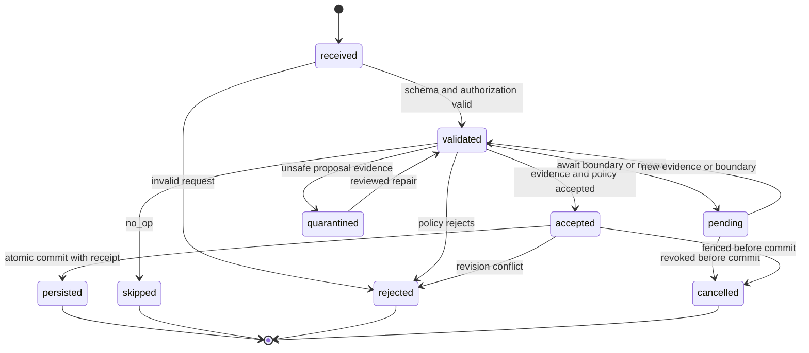
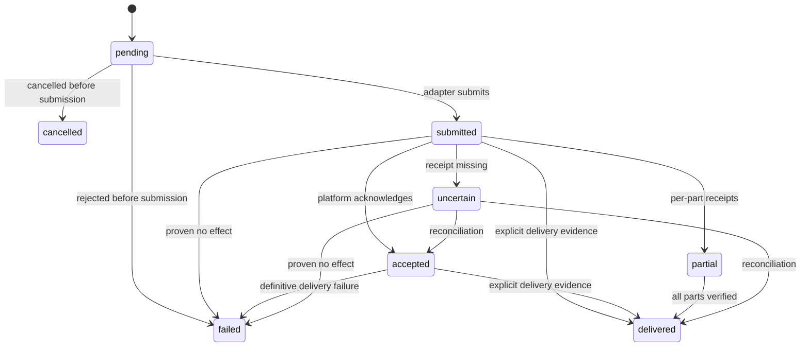

# 记忆与低风险主动纵向切片状态机 v0

> 导航：[设计总纲](./FRAMEWORK_DESIGN.md) / [主题目录](./FRAMEWORK_DESIGN_INDEX.md)。定位：详细状态规范草案；维护独立状态、失败与恢复，依赖公共结果及记忆接口。

> 状态：首条纵向切片的状态与失败语义草案。用于设计评审和录制场景，不代表当前运行代码已全部实现。

> 本轮范围：继续新记忆框架设计，细化写入并发、纠正/撤回、outbox 与回放。只维护文档和验收预期，不接入旧插件，不发布新的运行时 API；参考代码的局部测试不作为事务可靠性的证据。

字段及顶层 OperationResult 以[记忆外部注入契约](./MEMORY_PROPOSAL_QUERY_CONTRACT_V0.md)为准，DeliveryReceipt 使用[公共注入协议](./COMPANION_INJECTION_PROTOCOL.md)的状态。此处描述领域对象与操作间的因果关系，不另建一套外部结果枚举。

## 1. 分开持有状态

持续剧本只作为跨领域的局部投影：它消费已授权的 World/Relation/Affect/Memory/Session 状态，生成 `StorySegment` 供本轮扮演使用，并引用输入事件和 revision。它不拥有长期事实，也不能绕过 Memory Writer 把角色旁白写成 MemoryAtom。故事投影失效时丢弃或重编译即可，源 owner 的 revision 和撤回状态保持权威。

| 对象 / 所有者 | 状态或结果 | 与其他对象的关系 |
| --- | --- | --- |
| 提议 / Memory | received、validated、accepted、pending、quarantined、persisted、skipped、rejected、cancelled | accepted 只是 Writer 接纳；persisted 才关联已提交事实 |
| 事实 / Memory | active、superseded、invalidated、expired | pending/collected 属提议的暂存阶段；事实被检索不改变其状态 |
| 查询 / Memory | OperationResult 与 AnswerEvidence | 无写入也可查询；命中、注入和被答案使用单独记录 |
| 主动候选 / 核心 | proposed、deferred、selected、abstained、cancelled、expired | 记忆变更可触发评估，但不能自动变为 selected |
| 投递 / Delivery Gateway | pending、submitted、accepted、delivered、partial、uncertain、failed、cancelled | 核心先形成计划并授权，投递后以实际证据回填 |
| 用户反馈 / 核心 | waiting、observed、expired | delivered 不是用户确认，expired 不是负面反馈 |

外部插件通过 `memory.proposal.submit`、`memory.query`、`memory.operation.get` 和 `memory.changed` 接入。来源插件不持有核心投递状态，也不能将自己的“任务结束”当作用户已收到或事实已提交。

## 2. 提议与事实



提议的 schema/type 错误在入口拒绝；进入 quarantined 的是通过结构校验后需要审查的内容，按有期限的审查策略保存，不进入 active 召回。pending、quarantined 返回顶层 pending 和可查询 operation_id，内部 accepted 不直接作为对外成功。

correct 提交在同一事务中创建新 revision、关闭指定旧 revision 并写入幂等回执/outbox；retract 使指定目标 invalidated 并增加 memory revision。无权调用方看不到目标版本是否存在。重复提议返回原事实结果；新证据修复或修改 payload 属于新逻辑提议，不能复用旧幂等键覆盖结果。

任一提交前阶段都可因撤权、取消或 generation 失效终止；pending/quarantined/accepted 重启恢复均重新验证授权、证据和目标 revision。事务是否提交不确定时，操作结果保持 uncertain；不能把原事实回滚成 cancelled。被持久化的提议完成后，事实仍可由后续独立纠正/撤回操作演进。

## 3. 查询、主动与投递

```text
authorized MemoryQuery -> AnswerEvidence -> ContextContribution
                                            |
                            core evaluates relevance and timing
                                            |
                        MotivePlan -> selected / deferred / abstained
                                            |
                        ActionRequest -> DeliveryReceipt -> feedback
```

每条记忆不必产生主动候选，每个候选不必发送；普通查询可直接支持当前回复。查询结果包含明确状态和证据，投递前重新验证候选依赖的 revision、可见性、时效、会话占用和授权。纠正事件传播存在延迟时也不能跳过最后检查。



平台仅支持受理时保持 accepted，不猜测 delivered。已提交部分不能因取消而改写成未执行；取消只停止剩余部分并保留各 part_id 回执。partial/uncertain 对账只处理未确认部分，已成功部分不重做；缺少可靠对账能力时保留状态，禁止自动换提供方发送。

用户新消息优先吸收同主题候选，无关普通分享按占用态延后；已授权高时效提醒仍按自己的有效期处理。反馈 observed 必须有独立的用户回应或修正来源；曝光、检索、角色转述和沉默都不升级为事实确认。

## 4. 标准失败与恢复

| 场景 | 对外结果 | 恢复要求 |
| --- | --- | --- |
| 身份缺失 / 越权 | rejected/scope_required 或 permission_denied/forbidden | 不猜测身份或经兼容桥重试 |
| 提供方或必需扩展缺失 | unavailable/capability_unavailable 或 rejected/unsupported_feature | 仅相关能力降级，普通陪伴继续 |
| 查询证据不足 | succeeded/insufficient_evidence，items=[] | 可向用户表达不确定性，不补造事实 |
| revision 冲突 | rejected/revision_conflict | 保留当前事实，重新评估纠正提议 |
| 明确未提交的超时 | timeout/deadline_exceeded | 仅在原授权与总预算内重试 |
| 写入结果未知 / 投递结果未知 | OperationResult.uncertain / DeliveryReceipt.uncertain | 查账本/平台；不能当未执行 |
| 可选检索器失败 | partial/provider_partial | 返回其他路径的有效证据及 coverage，不增加预算 |
| generation 改变 | 提交前 cancelled/generation_stale；提交后对账 | 拒绝旧代回写，保留已提交的事实和回执 |

只有写入和投递要求逻辑幂等键；每次查询仍带 request_id、trace_id 和 provider_generation。写入去重键不包含 generation，在去重保证窗口内重载后重试可查同一事实；请求身份、语义 payload 摘要和有效作用域仍需重验。窗口外不自动重提，先按外部契约对账。

Memory 在本地事务提交事实、幂等回执和变更事件；消费方以 event_id 去重并按 revision 收敛。重启可回放事实和投影，禁止默认回放外部动作。旧代未提交任务只能由新代受监督任务按账本恢复、重新授权和校验后处理；提供方切换另需写入所有权交接。

## 5. 首批验收门槛

1. 私聊记忆不能在群聊召回；同一稳定归属跨会话连续，跨人格共享需单独授权。
2. 纠正后历史可解释，撤回/到期不能通过旧索引、缓存或旧候选恢复。
3. 重复提议和重载后查询回执只对应一次提交；同键不同内容拒绝。
4. submitted、accepted、delivered、uncertain 区别可观察，发送超时不重复投递。
5. 热重载阻止旧任务写回，已经提交的事实不被错标 cancelled。
6. pending 可在授权当前会话作为带状态的临时上下文，不能当作已确认长期事实。
7. 新类型/检索提供方遵守统一封套、权限和总预算，失败不触发新的后台主链。

## 6. 写入、纠正与回放的详细决策

本节补全第 2、4 节的提交与恢复要求。字段仍以契约包为准，内部工作单元、租约和 checkpoint 是实现必须提供的语义，不代表已经增加了公共 SDK 接口。

### 6.1 与现有机器契约对齐

| 概念 | 本轮采用的约定 | 不兼容的参考写法 |
| --- | --- | --- |
| 操作与目标 | payload.operation；correct/retract 使用 target_atom_id + expected_revision | 只含 assertion、缺少操作与目标的通用写入口 |
| 幂等键 | 标准封套中的 idempotency_key；稳定调用方身份参与去重 | 将幂等键搬入 payload，或把 generation 放进去重键 |
| 事实归属 | 可信解析产生 owner_ref；返回体携带归属证明 | 把 caller 自报 owner_ref 当成授权 |
| 成功写入 | status=succeeded、proposal_state=persisted、commit_state=committed | commit_state=persisted；或只有 operation_id 的不完整成功体 |
| 未知提交 | status=uncertain、reason_code=commit_unknown、commit_state=uncertain | 普通 failed + 自动重试，或缺少提交状态的 null 输出 |
| revision | expected_revision 是目标 atom 的版本；memory_revision 是 owner 的已提交变更水位 | 要求每个调用方用 base_memory_revision 锁住整库 |

参考草稿或原型与上表冲突时，应按机器契约修订原型。原型中预置一个“成功回执”只能验证一个返回分支，不能证明并发去重、真实持久化或回执丢失后的恢复。

### 6.2 唯一提交边界

准备阶段先完成有界解码、授权范围解析、证据读取和策略建议。语义判断和模型调用在短事务之外进行；纠正不强制一律待确认，是否需要确认由当前授权、证据和具名策略决定。

Writer 的一个工作单元按以下顺序提交：

1. 固定本次解析得到的 owner/namespace、调用方、payload 摘要、policy revision、Writer fence 和操作目标；校验尚有输入、存储及 outbox 额度。
2. 在 owner 的提交边界重新校验授权有效性、fence、deadline 和目标版本。撤权与所有权交接必须与该边界有可验证的先后顺序，不能只在提交前远程查询一次权限。
3. 在同一事务内领取幂等键，比较既有逻辑请求；并发相同键只允许一个赢家，不使用无保护的“查不到 -> 写入”两步判断。
4. 同事务更新目标版本/当前事实指针、操作状态与回执、owner memory_revision、撤回标记以及 durable outbox 记录。
5. 事务成功后才释放对外回执；外部事件投递由 dispatcher 独立完成，网络等待不占用事务锁。

pending/quarantined 只持久化提议、操作引用和必要证据，事实 revision 不增加，也不产生 memory.changed。no_op 的 skipped 回执可以落盘，但没有事实提交或 changed 事件。已存在的 pending 恢复时在同一 operation 上追加状态转移并重验条件，不靠换幂等键重新提交；语义 payload 改变则是新提议。

事实先 commit、随后调用独立 outbox.enqueue 的流程不满足本设计：两步之间崩溃会丢失变更通知。后端不能原子保存上述内容时，不能声明为权威 Writer；索引和投影可以异步更新。

| 故障时点 | 事实、回执与 outbox | 对外语义 |
| --- | --- | --- |
| 提交前拒绝或事务已证明回滚 | 无新事实；无该次事实 changed 项 | 按原因 rejected/timeout/cancelled，事实 commit_state=not_committed |
| commit 完成，dispatcher 断网 | 事实和回执已提交；outbox 可重试 | 仍是 committed；事件未送达不改成写入失败 |
| commit 返回丢失，无法判定 | 必须通过原账本对账 | uncertain/commit_unknown；不自动换 Writer 或换键重写 |
| commit 后授权撤销 | 保留已提交状态；输出重新鉴权 | 不向原调用者暴露受限事实，也不据此声称 not_committed |
| 旧任务取消通知到达，但底层工作未收敛 | 由 fence 和提交证据判定 | 未证实无提交前保持 uncertain，不以取消通知替代证明 |

### 6.3 revision、纠正与撤回

首版按单目标 atom 处理：atom_id 保持稳定，修订历史不可变。correct 使旧修订 superseded 并创建下一修订；retract 创建下一状态修订并使当前目标 invalidated。两个动作都原子推进 owner memory_revision，并发布一个指向提交后目标版本的 changed 事件。

| 场景 | 提交要求 |
| --- | --- |
| 两个 correct 都基于 A@7 | 最多一个提交 A@8；另一个 rejected/revision_conflict，不自动改成覆盖最新版本 |
| B 更新后再 correct A@7 | 若 A 仍为 7 且授权有效，可以提交；B 的变化不造成整个 owner 的伪冲突 |
| correct 与 retract 同时基于 A@7 | 由同一目标版本校验决定赢家；失败方重新读取已授权目标并评估，不自动恢复或撤回另一方的新修订 |
| 两个 add 竞争已声明的单值事实键 | Writer 在事务中校验该类型的唯一性约束；不得先各自检索为空再无保护插入 |
| 未声明单值语义的多值偏好或经历 | 保留并存；不通过相近中文词或模型相似度悄悄覆盖 |
| 目标不可见或不存在 | 在版本比较前执行授权，统一 target_unavailable/forbidden，不泄漏 revision |

具体轨迹：A@7 active、owner 水位 104；correct 后 A@7 superseded、A@8 active、水位 105；retract 后 A@9 invalidated、水位 106。此后即使 A@7 或 A@8 的索引、摘要或缓存仍存在，也不能作为当前事实召回。允许的历史解释与治理查询需分别授权，不能成为撤回绕过路径。

有效时间用于解释事实何时成立，revision 用于判定提交顺序，两者不互相替代。过去生效的纠正仍形成新提交版本；到期由 owner 产生新状态和 expired 事件。普通 retract 只证明撤回，不证明正文、备份和外部副本已经物理擦除；擦除、恢复与批量治理仍需另行设计。

### 6.4 幂等、pending 恢复与跨代对账

去重键沿用外部契约：稳定调用方身份 + owner + namespace + capability 主版本 + idempotency_key。不包含 request_id、provider_generation 或临时 session；重启不能使同一逻辑写入成为新操作。

语义摘要依据规范 payload 和已协商的必需 feature 生成，包含操作、明确目标/expected_revision、断言、证据、保留建议与扩展内容。仅规范化协议已定义的默认值和对象键顺序，不随意去除文本空白、改写断言或用模型判断“两句看起来一样”。request/trace、deadline、调用预算和进程 generation 不改变逻辑提议，但每次调用仍单独验证这些条件。

重复请求先鉴权再读取账本。同键同内容返回原操作的当前可披露状态和原提交证据；外层封套使用本次 request_id/trace_id 及当前 provider_generation。不能直接返回旧请求封套，也不能重新运行模型策略并产生第二个事实。pending 只有一次入账，但恢复任务可以在重验后继续该 operation 的合法状态转移；原 session 仍约束其临时可见性。

同键不同内容返回 idempotency_conflict。已知过期键返回 uncertain/idempotency_window_expired；操作不可见或不存在时不生成 not_committed 证明。有限去重窗口之外需要恢复账本、最小过期标记或人工/治理对账，不能无限堆积内存去重集合，也不能承诺永久 exactly-once。

### 6.5 outbox、重试与消费 checkpoint

outbox 项在事实事务内获得稳定 event_id 和源 revision。pending、leased、retry、acknowledged、dead_letter 是 dispatcher 内部状态，不成为 MemoryAtom 或 OperationResult 的新状态。事件已入账、传输已受理、消费者已持久化应用三个阶段分别记录。

dispatcher 使用有期限租约、有界批次、总重试预算、退避和抖动。超时或确认丢失时重发同一 event_id，不创建新事实或新逻辑事件。取消、重载和租约过期只影响投递责任；新 worker 可以接续投递已提交事件，旧 worker 不能领取新任务或覆盖新租约状态。

消费者优先把 projection 更新、event_id 去重凭据和消费 checkpoint 放进同一持久化事务，再确认。确认前崩溃允许重复传输，但重放不得重复修改投影或产生外部动作。不支持同事务时，需要可重入的投影更新和持久化去重，checkpoint 始终在应用成功之后推进；仅在内存 set 去重不满足重启恢复。

`memory_revision` 是 owner 的事实水位，不是已授权订阅流的连续序号。授权过滤会产生合法的 revision 跳跃，不能据此判断丢事件。消费者用绑定订阅身份和授权版本的不透明流游标检测过期/缺口；并发批次只能推进已完整应用的连续游标，不能跳过未确认事件。契约包 0.2.0 已单独定义控制消息和批次的 review Schema，不改变当前封闭的 memory.changed payload。

投递时重新检查订阅授权；撤权后停止正文/事实 ID 通知并使相关缓存授权版本失效，失效通知不透露隐藏目标。源提交 generation 和订阅派发的当前 generation 分开验证：新实例可投递旧事务的已授权 outbox，不能把旧句柄重新授予写入权。

### 6.6 撤回传播与跨平台回放

memory.changed 仅携带既定的 ID/revision 等元数据。对 A@9 的 retracted 事件，消费者先取消依赖旧版的候选并使缓存失效，再更新索引/projection。随后到达的 A@8 corrected 事件不能降低 A 的已见版本或恢复其可见性。查询与上下文输出仍向权威 owner 复验授权、当前版本和有效时间，不能只等待事件传播来保证撤回。

回放默认只重建投影，不调用 proposal.submit，不重做图片、消息或设备动作。重建使用同一逻辑 owner、已验证 lineage 的快照、墓碑和后续变更流；平台转换只负责原生输入与 canonical ref，不修改事实主体或归属。

游标超保留期或快照过旧时，旧 projection 标记不可作为新鲜依据；从已授权的有界快照水位重建，再衔接日志后缀。墓碑或等价失效证明在快照压缩和备份恢复后仍可验证；无法证明时禁止把旧事实恢复到 active 查询。慢订阅者应进入需重同步状态，不能要求 outbox 永久等待它或无限占用内存。

### 6.7 内存、存储与延迟预算

输入/输出字节上限只是接口边界。Python 对象、索引和媒体解码可能放大占用；等 provider 已经组装完整列表后再校验大小，不能阻止那次峰值。设计预算必须覆盖分配之前的准入、provider 下推限制以及处理中的计量。

| 占用来源 | 设计约束 |
| --- | --- |
| 提议解析与策略上下文 | 有界解码、增量摘要；只保留本次必要证据与读集，拒绝前不做全量冻结/深拷贝 |
| 提交并发 | runtime 总在途字节预算与 provider/owner 子额度共同准入；按需创建任务，不预先构造海量 coroutine；核算单任务对象放大后的工作集 |
| 事实事务 | 只更新目标、幂等回执和 outbox 等有界行；不复制整个 Memory store 来模拟事务 |
| outbox 与 pending | 持久化分页、有界拉取、存储额度和保留策略；队列饱和在普通新写入提交前背压，撤回/治理保留处理容量，不先提交事实再丢通知 |
| 缓存与去重 | 按字节计量的全局容量 + TTL + owner 配额；持久化去重窗口可分页读取，不在内存永久保存所有 owner/key |
| 回放与索引重建 | cursor 分批、分段 checkpoint、增量索引；限速并给在线查询留额度，暂停重建不阻塞普通对话 |
| 日志与指标 | 记录大小、耗时、队列滞后和原因码；不保存原始记忆/完整 prompt，不以无限 owner ID 作为常驻指标标签 |

应观测空闲基线、峰值 RSS、Python 分配、队列在途字节、缓存字节、处理延迟和释放后残留。相同预算下分别增加历史量、并发请求数、owner 数和故障持续时间；目标是应用常驻内存受已声明预算控制，冷历史增长主要进入受保留策略约束的存储。常数阈值按部署 profile 与压测确定，文档不宣称某个 MB 数适合所有平台，也不强制为记忆再启一个常驻进程。

### 6.8 订阅、确认与增量重同步

`memory.changed.v1` 继续保持现在的封闭事件 payload；订阅控制、投递租约、确认和重同步不能把调用方字段硬塞进事件本体。可协商控制能力为 `memory.changed.subscribe`、`memory.changed.ack` 和 `memory.changed.resync`，首版 request/result、批次、引用快照与 checkpoint Schema 见[外部契约 §8.1](./MEMORY_PROPOSAL_QUERY_CONTRACT_V0.md#81-订阅控制-wire-决策与恢复轨迹)和契约包 0.2.0，成熟度仍为 review。

**绑定。** 订阅建立时由 Runtime 解析 subscriber、owner/namespace、purpose、可见 change_kind、policy revision、provider generation、schema fingerprint、批大小和 deadline。调用方不能自报 owner，也不能把一个广泛的订阅绑定到多个未授权 partition。订阅句柄和游标由服务端生成，绑定订阅者、授权版本、保留 epoch 和数据 lineage；它们用于定位和恢复，不授予权限，每次投递和确认仍重新鉴权。控制操作复用公共 subscribe/acknowledge/release 生命周期；这里的候选能力名不另建注册或授权入口。

维护 active 投影的订阅必须覆盖纠正、撤回、到期及授权失效。首版 current_projection 必填四种 change_kind，可选过滤只用于 notifications；独立失效旁路须未来协商，当前不能借此省略撤回。不允许只订阅 added 后仍宣称缓存保持新鲜。

**游标与 checkpoint。** 服务端签发的不透明游标关联 stream binding、扫描位置、保留/快照 epoch、授权与 policy revision、lineage 和过期时间；内部可关联最后一个可见 event_id 及 owner memory_revision，但不能向消费者暴露被过滤对象。游标不能由调用方编辑，也不以 `memory_revision` 的连续整数表示完整性。

投递批次的起止游标只是服务端提出的进度。消费者持久化的 checkpoint 记录已应用的投影代次、流绑定、截止游标及去重/版本凭据；服务端另存已接受 ACK 的游标。三者不能混为一个变量。授权过滤可以产生合法 revision 跳跃，甚至没有可见事件：空批次也须有服务端出具的扫描边界，消费者持久化该进度后才可确认；不能自行加一或推测过滤了多少事实。并行批次只能累计确认连续已完成的游标区间，后页先完成不能越过尚未应用的前页。

**投递状态。** 消费者状态为 `bound -> leased -> delivered -> applied -> acknowledged`；租约过期、网络断开或确认丢失回到可重投的 `leased`，而非生成新 event。`resync_required`、`revoked`、`expired` 和 `dead_letter` 是订阅/dispatcher 状态，不是 MemoryAtom 状态。至少一次传输是默认语义；投影的 event_id 去重、版本比较和 checkpoint 才提供可恢复的一次逻辑应用。

ACK 只确认 event 已经在授权边界内持久应用，不能用“收到 callback”或“放入内存队列”确认。ACK 复用 event_id/游标的原始绑定，校验 subscriber、subscription、租约、generation 和已派发的边界；不能确认未发出的未来位置。当前绑定下重复 ACK 是幂等的；旧租约或旧 generation 的 ACK 不能覆盖新租约。应用成功而租约失效时，消费者在新租约收到重投后依据持久化去重凭据确认，不重新产生逻辑效果。投递拒绝、业务解析失败和暂时存储失败分别记录原因，不能把坏事件无限重试；同一 event 的最终失败进入有界死信并触发重同步，而不是静默丢弃撤回。

**顺序。** 首版单 owner 以 `(memory_revision, event_id)` 作为应用排序键；同一 atom 还比较 `atom_revision`，低版本和内容一致的重复事件均为投影 no-op，较新版本才推进状态。不能因为已收到 owner 水位 106，就丢掉另一个 atom 尚未应用的 105 事件。相同 event_id 对应不同源 payload，或同一 atom/revision 有矛盾状态时，隔离订阅并要求对账/重同步，不能按重复件静默忽略；当前派发封套的 generation/scope 变化不等于源 payload 改变。wall-clock `occurred_at` 只用于说明时间，不决定版本顺序。跨 owner、跨 namespace 和跨平台流不建立隐含全局顺序。

**重同步。** 游标过期、保留日志已压缩、policy/lineage/schema 变化、服务端流连续性证明不成立或消费者本地状态损坏时，控制面返回不含隐藏事实的 `resync_required`。这表示订阅状态，不增加 OperationResult 顶层 status；普通 revision 数字跳跃不构成缺口证明。snapshot 必须覆盖当前授权投影及必要的可披露失效记录，固定 owner、lineage、授权/policy revision、schema、快照 epoch、边界水位 W 和到期时间。首版 references 投影仅同步 active 事实引用和墓碑，正文经 owner 当前权限查询，不能宣称完成全量数据迁移。普通 memory.query 的分页或 memory_revision 返回值不能直接证明这一快照边界。

恢复按以下持久化步骤执行，任何一步都不要求全量驻留内存：

1. 服务端建立同一一致性边界 W 的快照和 W 之后可续接的日志位置，按页读取；快照有效期内保留必要后缀。不能先分页读当前事实，再随意取一个最新水位拼成快照。
2. 消费者把每页写入独立的持久化 staging 投影，局部事务保存该页结果及恢复 checkpoint。页序、完成标记和校验信息由服务端关联快照生成；未收到完整性证明不激活 staging。
3. snapshot 后缀也按预算分批应用到 staging，保持 inbox 去重和 atom/state watermark。服务端提供可验证的后缀截止游标 C；在准备切换前至少应用到 C，持续新写入从 C 后接续，不等待整个系统停止写入。撤回即时可见性仍由查询时 owner 复验保证。
4. 消费者在短本地事务中切换 active projection 指针，并发布与该投影一致的 inbox/checkpoint 引用；页面数据已落盘，切换不再复制全库。切换前重新核验授权、epoch 和绑定，完成后才确认 snapshot/C。此时仅证明处理到 C，不能宣称之后无变更。

中断后只恢复仍有效的 snapshot epoch 和页级 checkpoint；过期、撤权或失去日志后缀保证时废弃 staging，按新授权重新绑定和恢复。旧投影不能先删除，也不能在失效后继续作为当前查询依据；切换完成后按额度回收旧代。每一页、引用解析、切换和 ACK 均受当前授权限制；旧权限快照不可续读。无权对象不以墓碑 ID 形式泄漏，通过完整替换授权投影并失效旧代排除即可。

旧事件晚到时仍按 atom_revision/state watermark 拒绝回退；墓碑或等价证明必须覆盖允许的快照/日志恢复窗口。无法保留时先使受影响 epoch/cursor 失效，要求完整替换式重同步；不能缺失失效证明还继续叠加旧投影。无法提供一致授权快照或完整后缀时返回 unavailable，不能用旧缓存或 proposal.submit 补数据。

**撤权和回放。** policy revision、owner binding、schema fingerprint 或 subscriber generation 变化可以使游标立即失效。停止正文/事实 ID 投递的撤权通知不能透露被撤销对象；缓存失效只携带不透明订阅引用。canonical 回放默认只执行事件消费和 projection 重建，禁止触发 proposal、消息、图片、设备、模型或其它外部动作；测试 harness 需对这些端口设置零调用断言。

**资源边界。** 订阅拥有 `max_batch_items`、`max_batch_bytes`、`max_inflight_bytes`、并发订阅数、单租约处理时限和总重试预算；各订阅子额度服从 runtime 总在途预算。dispatcher 按页读取并持久化租约，不预取无界批次。staging、旧/新投影并存、inbox、墓碑和日志后缀均计入磁盘额度，快照 pin 也有时限与容量限制，避免长快照拖住数据库 WAL/版本回收。页面完成或重连不能重置一次重同步的总预算。

慢订阅者超出保留/积压额度后脱离在线投递并转入 resync_required，随后仅按保留与恢复证明回收日志；不能让单个消费者永久钉住 outbox。仅暂停消费不能解决存储耗尽：总存储额度仍不足时按 §6.7 在普通事实写入提交前背压，治理/撤回使用预留容量。已提交事实和 durable outbox 不被静默删除。重同步并发和页面分配须先准入，不能等 provider 全量物化之后才拒绝超限输出。

本节语义已映射到契约包 0.2.0 的控制 Schema、90 个新增格式案例和版本化恢复夹具，不增加 `memory.changed.v1` 字段。checkpoint 区分 snapshot_pages、snapshot_tail、active；尾部 ACK 只保存 staging 进度，独立 snapshot ACK 才将服务端订阅推进为 live。Schema 与夹具仍在评审，未执行真实租约、快照或平台恢复。

### 6.9 持久化记录、对账与故障 barrier

本节把前述语义落到最小的持久化责任上。它是 Memory owner 的内部记录设计，不是要求所有部署使用同名表，也不允许调用方直接读取数据库。每条记录均需有 owner/lineage 和保留策略；正文、证据和投影可以由不同存储承载，但下面的关联和提交顺序必须可验证。

| 记录 | 必须保存的最小信息 | owner / 访问边界 |
| --- | --- | --- |
| `operation_ledger` | operation_id、稳定 caller/owner/namespace、能力主版本、幂等键、规范 payload 摘要、目标/expected_revision、当前状态、commit_state、原始提交 generation、receipt_ref、created/expires | Memory Writer；原调用方或获授权治理入口通过 `memory.operation.get`/公共 lookup 读取，不能用任意 key 枚举 |
| `proposal_record` | proposal_id、操作、归属和可见性、证据引用、策略 revision、pending/quarantined/persisted/skipped 状态、语义 payload 引用 | Memory Writer；pending 不得作为 active 事实查询 |
| `atom_revision` | 稳定 atom_id、不可变 revision、断言/必要证据引用、状态、有效区间、supersedes/retracts、提交 memory_revision | Memory owner；查询先验证当前 ACL、保留和墓碑，索引只能保存可重建引用 |
| `owner_head` | owner_ref、当前 memory_revision、writer_fence、policy/lineage revision、最后提交时间、恢复 epoch | 单一权威 Writer；迁移/接管使用 CAS 或等价 fence，不接受 caller 自报水位 |
| `outbox_event` | 稳定 event_id、source owner/atom revision/memory_revision、change_kind、payload 摘要、lease、attempt、next_retry、投递状态、保留截止 | Owner dispatcher；事件只按订阅授权投影，不把正文复制到中央队列 |
| `idempotency_marker` | caller/owner/能力主版本/幂等键、payload 摘要、首次时间、保留窗、过期结果与最小 commit_unknown 标记 | 与 operation ledger 同一去重命名空间；窗口外可回收，不能回收成“未提交证明” |
| `subscription_binding` | subscription_id、subscriber、owner/namespace/purpose、权限/policy revision、generation、lineage、view/contract fingerprint、保留 epoch、状态和租约 | 订阅控制面；每次投递、ACK、重同步重新鉴权 |
| `snapshot_staging` | snapshot_id/epoch、W、页链、页 hash/字节累计、completion_token、C、activation lease、过期时间 | Subscriber owner；不可直接替代 active projection，超额按页清理 |
| `projection_checkpoint` | projection_generation、subscription binding、state、snapshot/page/stream cursor、inbox_ref、last_event_id、版本水位、stored_at | 消费者 owner；ACK 只能确认已持久应用的连续边界 |
| `budget_ledger` | caller/owner/任务范围、预算 revision、预留/消耗/释放字节、并发槽、模型/存储/重试额度及原因 | Runtime 与 Memory owner 共享的有界额度；重试和分页沿用原预算，不复制初始额度 |

`receipt_ref`、`inbox_ref`、页游标和证据引用是定位值，不是文件路径、数据库连接或下载权限。诊断可以保存脱敏的 reason_code、时间、版本和计量，不能用完整 prompt、原始私密正文或无限 owner 标签填充常驻日志。记录的物理分区、索引和压缩可以因宿主改变，但必须保留稳定逻辑 ID、lineage、墓碑和有效 revision。

#### 原子事务边界

1. **Writer commit。** 在提交事务内锁定/比较 `owner_head`、领取 `idempotency_marker`、写入 `operation_ledger` 和 `proposal_record`，并按 add/correct/retract 更新 `atom_revision`、owner memory_revision、必要墓碑和 `outbox_event`。所有这些成功后才可对外报告 `commit_state=committed`。no_op 仍可写 operation ledger，但不写 active atom 或 changed event。
2. **Writer reservation。** 有界解码、证据读取和策略建议在事务外完成；输入、存储、outbox 与总在途额度先在 `budget_ledger` 取得可回收预留。预留失败不创建 pending 事实；提交成功后按实际计量结算，异常退出由 owner lease 回收，不能把释放额度再分配给旧 generation。
3. **Dispatcher lease。** outbox 事务只更新 lease owner、attempt、退避和 delivery 状态，不改变 atom 或 operation 的事实提交。发送/ACK 回执丢失重投同一 event_id；旧 lease/generation 不能覆盖新 lease。outbox 饱和时普通写入在 commit 前背压，撤回/治理保留独立处理额度。
4. **Projection apply。** 消费者在一个本地事务内更新 projection、inbox 去重/版本凭据和 checkpoint；事务完成后才 ACK。投影事务失败只影响该批次，不能回滚源事实或凭空生成新 operation。没有同事务能力时使用可重入更新和持久 inbox，不能只用内存 set。
5. **Snapshot activation。** 每个 snapshot page 先落 staging 并推进 page cursor；末页完成 token、W/C 和 activation lease 经 owner 验证后，消费者在短事务切换 projection、checkpoint 和 projection_generation。切换前的 resyncing ACK 不表示 active；切换失败保留 staging 或有界清理，不能用旧 projection 宣称新鲜。

#### 启动、接管与恢复顺序

1. 新 runtime 先鉴别安装、caller、owner lineage 和当前 policy，再生成新的 provider/dispatcher generation；备份中的 binding、lease、句柄和旧 callback 一律不可直接恢复为 active。
2. Writer 读取 `owner_head` 与未终止 `operation_ledger`，按 commit marker、atom revision 和 outbox 关联判定 committed/not_committed/unknown。`unknown` 只创建受监督的查账任务，不能换幂等键或换 provider 重写。
3. 仅在当前授权、writer fence、剩余 deadline/预算和 payload/证据仍满足时恢复 pending；已过期或撤权的提议进入 rejected/expired 并保留最小操作回执。新代不能让旧 worker 继续持有写 lease。
4. outbox 先恢复已提交事实的事件投递，再恢复消费者 checkpoint；投影落后不阻塞事实查询，但 current projection 在未完成重同步前必须标记不可作为新鲜依据。旧事件按 event_id/atom revision 收敛，禁止回放外部动作。
5. 跨平台或整体打包先导入 owner/identity lineage、atom revisions、tombstones、operation receipts、outbox 和预算/保留元数据，执行 hash、ACL、revision 和幂等窗口检查，再由新宿主重新 bind。无法证明撤回和快照边界时，目标事实保持 unavailable/needs_resync，不恢复为 active。

#### Barrier 与对账结论

| 观察到的 barrier | 允许的结论 | 必须保留的记录 |
| --- | --- | --- |
| 未准入，或事务已证明回滚 | `not_committed`；可按新授权重新评估 | operation 终止原因、预算释放和拒绝证据 |
| Writer commit marker、atom revision、outbox 均存在 | `committed`；事件投递可独立重试 | operation/atom/outbox 三者关联和原 generation |
| 响应丢失或三者关联不完整 | `uncertain`；禁止自动换键重写 | operation、payload 摘要、最小 marker、查账期限 |
| 事实已提交但事件/ACK 未完成 | 事实仍 committed；投影/订阅为 lagging/resync_required | outbox lease、checkpoint 和投递尝试 |
| 撤权/新 fence 到达但旧 worker 未收束 | 新派发拒绝；旧效果按账本对账 | writer fence、旧代 lease、迟到结果，不伪造 cancelled |
| 快照页或尾部缺页、W/C 无法证明 | projection 不可用或 `resync_required` | snapshot staging、缺口、旧投影 generation，不恢复旧缓存为新鲜 |

`memory.operation.get` 只返回当前调用方有权看到的操作和必要状态；查不到、过期或 owner 暂时不可用不证明 `not_committed`。批量恢复由 owner 的有界 supervisor 分页执行，可合并同一 operation/订阅的等待；不为每条未知记录创建永久轮询器。任何自动重试都必须同时满足原幂等窗口、当前授权、有效 fence、剩余预算和可验证的未提交/远端幂等证明。

#### 设计完成与运行状态

至此记忆设计的领域对象、外部能力、公共封套、持久记录、事务边界、订阅恢复、迁移、资源预算和故障 barrier 已形成一套 review 基线：契约包 0.2.0、Schema/夹具和本节内部记录语义相互引用，不再需要另建一份记忆控制协议。剩余工作是把这些语义绑定到隔离实现并取得证据，而不是继续增加平行字段或旧入口。

MW-01--24、SUB-01--16、EXT-01--14 的运行结果仍保持 `not_run`。格式校验、静态关联和设计走查不能证明真实事务原子性、租约顺序、峰值内存或平台迁移；实现阶段必须按上述记录/barrier 输出原始证据，并分别报告 passed、failed、skipped 和 not_run。

### 6.10 与世界模拟能力的组合边界

世界模拟可以是陪伴核心内的 Feature Service，也可以由独立的世界模拟插件提供；两种装配方式使用同一组能力和 DTO。它不能成为第二个记忆库，也不能直接写 `MemoryAtom`。世界模拟保存“人格所属的生活世界当前如何运行”，Memory 保存有证据、可治理、需要跨时间召回的事实；现实触及保存外部观察和动作回执。

| 数据/能力 | 权威 owner | 允许产生的长期效果 |
| --- | --- | --- |
| `WorldEntity`、`WorldRelation`、场景资源与人格内部地点 | World Simulation；归属 `installation + bot + persona` | 维护 `world_revision` 和关系/资源状态；不默认成为用户现实事实 |
| `ActivityProcess`、当前 `EmbodimentState`、注意力和可打断长活动 | World Simulation | 保存可恢复 checkpoint；完成/中断时可发布 `ActivityEpisode`，不按每个 tick 写长期记忆 |
| `ActivityEpisode`、`WorldEvent` | World Simulation 产生，Kernel 路由 | 携带 `observed|simulated|derived|user_stated` 和 source refs；只有通过 MemoryProposal 才能成为长期记忆 |
| 现实设备/位置/健康观察及动作结果 | Reality owner / Platform Adapter | 作为带 TTL、证据和真实回执的观察或动作事实；不能被角色模拟覆盖 |
| 用户确认的偏好、承诺、共同经历、纠正和撤回 | Memory Writer | 产生 atom revision、outbox 和可查询证据；可影响世界模拟，但不改变世界 owner |
| 动机、候选和表达计划 | Kernel / Proactive Planner | 只产生有限候选和 ContextContribution；不直接提交世界状态、记忆或消息投递 |

#### 统一引用和状态字段

世界模拟事件至少携带 `world_event_id`、`world_owner_ref`、`subject_ref`、`kind`、`reality_mode`、`valid_from/valid_to`、`world_revision`、`process_ref`、`source_refs` 和 `caused_by`。`world_revision`、`process_revision`、`memory_revision` 和 `policy_revision` 是不同的水位，不能互相填充。`reality_mode=simulated` 表示角色内部世界的状态，不能在没有现实来源和授权的情况下被查询为用户已发生的活动；`derived` 表示经过规则或模型推导，也不能冒充原始观测。

世界状态变更使用 `StateTransitionProposal`，由世界 owner 校验实体存在性、目标 revision、可行性、来源和幂等键后提交。目标为单个 ActivityProcess 时使用 `process_revision` 竞争，资源变更另验其实体 revision；`world_revision` 作为世界变更水位，不能拿它代替单活动版本。详细过程见[世界模拟切片 §7--§11](./DOMAIN_STATE_MACHINES_V0.md#7-世界模拟纵向切片学习被打断与跨会话恢复)。Memory 需要的长期结果使用标准 `MemoryProposal`，其 `caused_by` 引用世界事件和证据，但仍需单独验证 scope、purpose、retention 和用户治理授权。世界插件不能通过在事件中填写 `owner_ref`、`atom_id` 或高置信度绕过 Memory Writer。

#### 双向数据流

```text
MemoryQuery (授权的事实/经历/偏好)
  -> World Context Adapter
  -> AffordanceSnapshot / PersonaWorldModel 的短期投影
  -> ActivityProcess / MotivePlan / ResponsePlan

Reality Observation / User Message / Together Session
  -> EvidenceRef + WorldEvent
  -> StateTransitionProposal
  -> ActivityEpisode / PersonaContinuityState revision
  -> 必要时 MemoryProposal
  -> Memory Writer
  -> memory.changed
  -> World Projection / 主动候选失效或重算
```

从 Memory 到世界模拟的读取必须使用 `memory.query` 和有界 `ContextContribution`，只返回当前用途所需的实体、关系、经历和证据引用；不把整个 `PersonaWorldModel` 或 Memory store 拼进 Prompt。世界模拟可以缓存短期投影，但缓存键包含 persona/world/memory/policy revision 和用途，撤回、纠正或权限变化立即使相关投影失效。

从世界模拟到 Memory 的写入只发生在具名边界：用户明确确认或纠正、长活动完成/中断形成可解释经历、承诺边界、会话结束摘要、或策略声明的 durable transition。每分钟推进、场景描写、模型猜测、一次性道具变化和没有证据的角色旁白只留在 world state/checkpoint，不自动创建长期记忆。是否提议写入由 AI 结合语义稳定性判断，代码负责证据、scope、revision、预算和提交安全。

#### 不形成循环的规则

1. `WorldEvent` 是世界 owner 的输出；`memory.changed` 是 Memory owner 的输出。两者必须保留各自 event_id 和 source，不允许 world plugin 伪造 memory.changed，或 Memory 根据自身变更直接推进外部动作。
2. 由 `memory.changed` 触发世界投影时，只更新依赖该事实的实体/关系/候选，并以 `caused_by` 和 revision 去重；同一 revision 的重复事件是投影 no-op。
3. 世界投影失效后若需要修改长期事实，创建新的 `MemoryProposal` 和新幂等键；不能在事件消费回调里原地改写 atom，也不能用原 memory revision 再发一条“确认事件”。
4. Memory 撤回或纠正可以使 ActivityProcess、AffordanceSnapshot 和 ProactiveCandidate 失效，不能自动结束现实设备动作；已提交动作仍按 OperationResult/DeliveryReceipt 对账。
5. 世界模拟缺失、过期或降级时，Memory 仍可查询事实；Memory 不可用时，世界模拟只能使用仍有效的本地 checkpoint/短期上下文，并标记 `memory_unavailable`，不能静默复制全库。

#### 拟议能力与资源边界

世界模拟提供方可声明 `world.model.query`、`world.state.transition`、`world.activity.advance` 和 `world.event.publish`；具体版本、权限和输入/输出 Schema 通过公共 CapabilityDescriptor 协商。`world.state.transition` 的 side effect 是 local，`world.event.publish` 只发布世界事件，不能代替 Memory 提交。涉及现实设备、平台消息或付费资源的动作必须另绑定对应 execute 能力。

世界模拟的高频状态使用 checkpoint、事件折叠和有限时间线；Memory 只接收边界摘要。`AffordanceSnapshot` 按实体数、UTF-8 字节、有效期和用途裁剪，不复制媒体或完整历史。世界进程、Memory 查询、摘要任务和主动评估共享 runtime 总在途字节、并发、模型调用和存储预算；活动推进不能通过每分钟唤醒或每次对话全量重建来维持。

#### 世界模拟联动验收场景

以下 WMS 场景是记忆与世界模拟共同验收要求，均为 `not_run`：

| case_id | 场景 | 必须保持的边界 |
| --- | --- | --- |
| WMS-01 | 角色内部模拟“正在散步”，用户询问现实位置 | 只返回 `simulated` 世界状态；无现实观察时不声称用户或设备在散步 |
| WMS-02 | 用户确认“以后不喜欢咖啡”，世界模型仍有旧偏好投影 | Memory correct 提交新 revision；旧世界投影失效并重算，不能由世界缓存覆盖新事实 |
| WMS-03 | ActivityProcess 跨多个会话暂停、恢复、完成 | 只持久化 process checkpoint；完成边界生成一次 ActivityEpisode/可选 MemoryProposal，重复恢复不重复写入 |
| WMS-04 | 现实设备报告回家，角色模拟世界处于出门状态 | 现实观察和模拟状态并存并标注来源；不得静默覆盖另一 owner，场景决策显式处理冲突 |
| WMS-05 | Memory retract 发生在世界活动和主动候选进行中 | 依赖该事实的 projection/candidate 失效；已提交外部动作保留回执，不由回调重发或撤销 |
| WMS-06 | 世界事件消费回调和 memory.changed 重复/乱序 | 依靠 event_id、caused_by 和各自 revision 去重；不形成 Memory→World→Memory 无限循环 |
| WMS-07 | 世界模型读取跨人格/用户的记忆或导入另一平台快照 | scope/owner/visibility 拒绝越权；只复制授权 projection，不能按相似昵称合并世界或记忆 |
| WMS-08 | 大量长活动、实体和历史同时增长 | checkpoint、事件折叠、AffordanceSnapshot 和 Memory 投影有界；峰值内存、队列、存储和释放残留可观测 |

WMS-01--08 的通过条件是“状态来源和归属正确”，不是让世界模拟更像真实世界的语言评分。世界模型的表达质量、角色风格和主动时机仍由 PromptCompiler/Planner 的独立语义评估处理；不得用自然语言演示覆盖 `reality_mode`、授权或提交证据。
